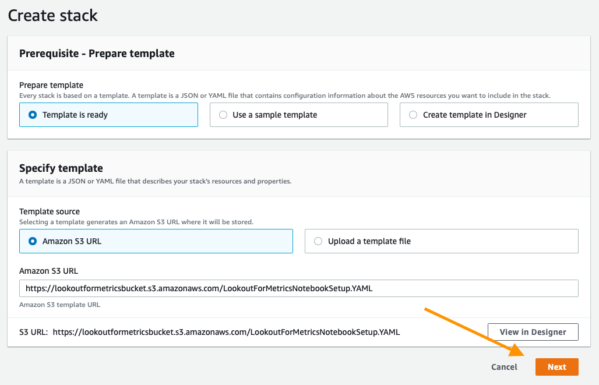
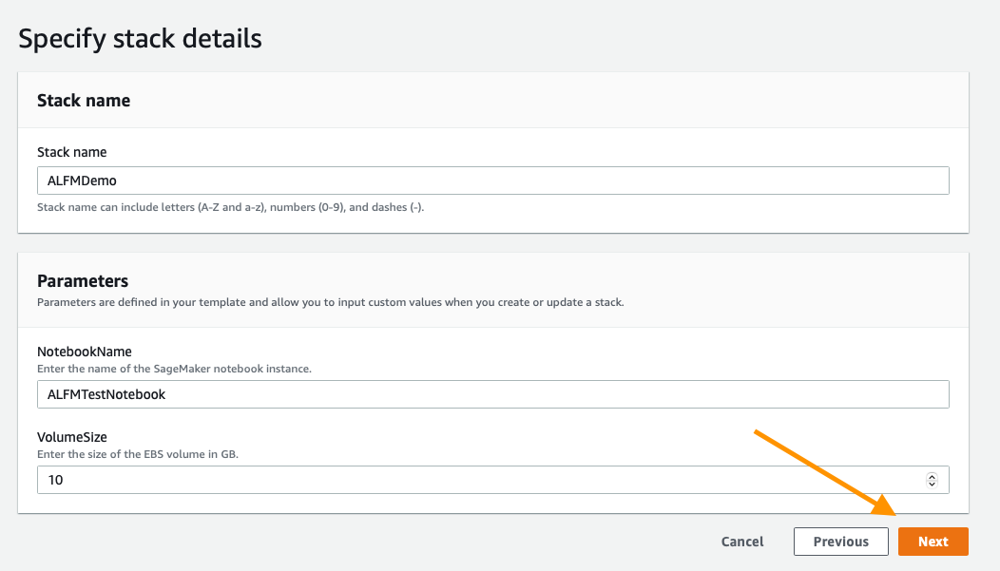
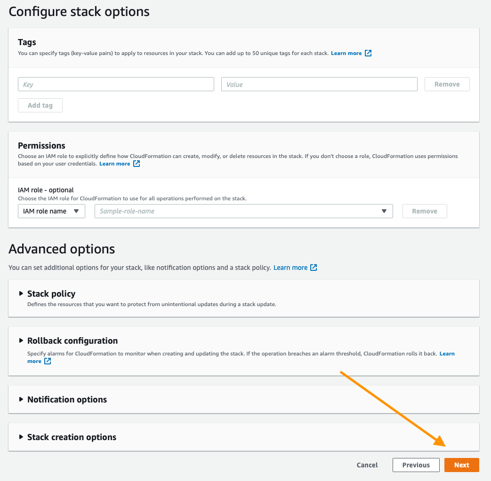
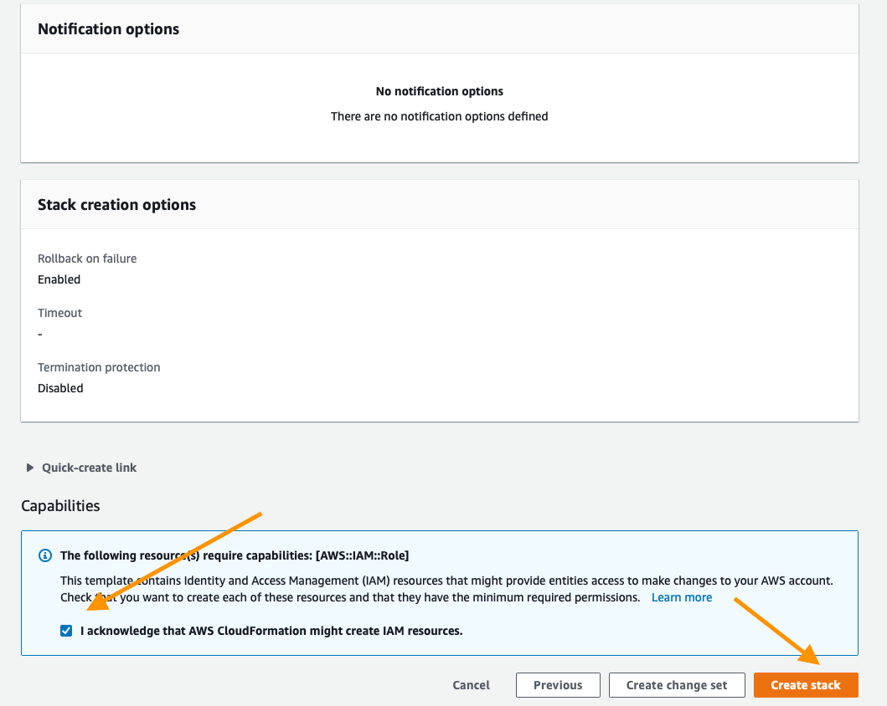
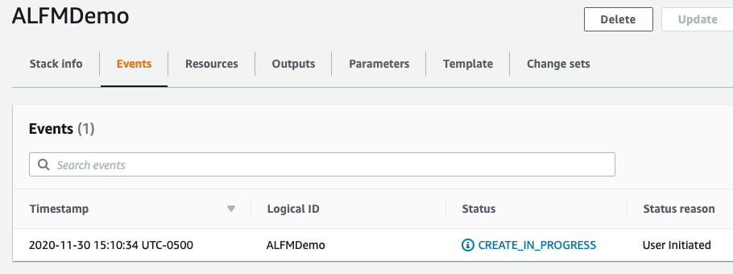
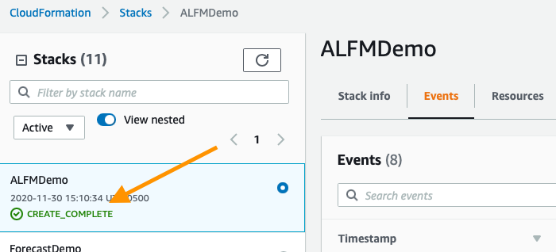
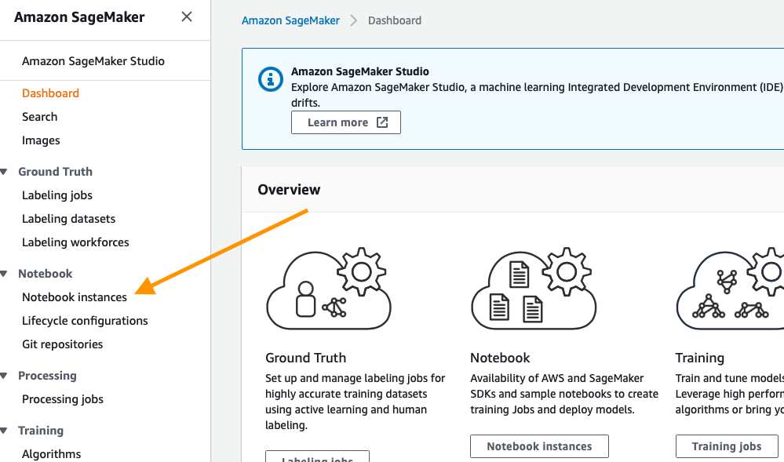
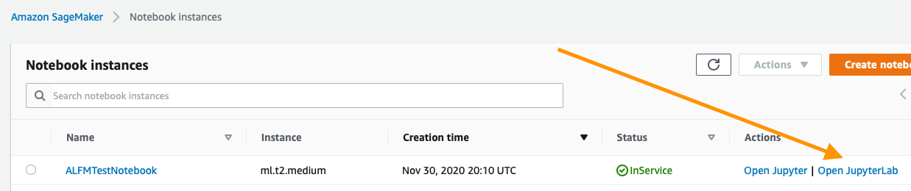

# Amazon Lookout for Metrics

Amazon Lookout for Metrics is a new service that detects outliers in your time-series data, determines their root causes, and
enables you to quickly take action. Built from the same technology used by Amazon.com, Amazon Lookout for Metrics reflects
20 years of expertise in outlier detection and machine learning.

With Amazon Lookout for Metrics, you can build highly-accurate, machine learning models (called detectors) to find outliers
in your data, without any machine learning expertise. Amazon Lookout for Metrics detects outliers on live or real-time data. If
you have historical data, Amazon Lookout for Metrics will use it to train a model which will then detect outliers on live data. If
you do not have historical data then Amazon Lookout for Metrics will train a model on-the-go. Using the Amazon Lookout for Metrics console or SDK,
you simply provide Amazon Lookout for Metrics with the location and scope of your data. This includes the measures, which
are the variables that you want to investigate (like revenue), and dimensions, which are the categorical
variables that correspond to a measure (revenue can have dimensions such region and product category).
Amazon Lookout for Metrics then automatically chooses the best machine learning algorithm to optimize performance for
your outlier detection use case and begins training a detector. Amazon Lookout for Metrics uses this custom-trained detector
to monitor your chosen metrics for outliers, allowing you to quickly identify and resolve issues that are
likely to impact your business. Amazon Lookout for Metrics can also integrate with Amazon SNS to alert you when the service
detects important outliers.

This guide will walk you through the steps needed to configure local or SageMaker environment for working with Amazon Lookout For Metrics. At the end of this guide, move on to the Jupyter notebooks to explore the service in more detail.

## Preview

The service is available in preview. To find out more, go to https://aws.amazon.com/lookout-for-metrics

## Reference Architecture

Amazon Lookout for Metrics is designed to primarily focus on alerting you to real-time anomalies within your data(Continuous), however there is a secondary mode for backtesting to help you explore historical items and to learn what Amazon Lookout for Metrics may be able to help you react to in the future(Backtesting). Both architectures are illustrated below:

### Continous Data Architecture

.png)

#### Continuous Mode:

1. Create and configure a detector: 
    1. Provide a detector name and description
    2. Select the data frequency.
2. Create and configure a dataset:
    1. Point to the S3 location of your data when using the SDK or select the `Detect` option when using the console 
    2. Configure the IAM permissions needed to access it.
    3. Select a timezone of your data
    4. Declare the measures and dimensions and map them to the appropriate fields in your data
    5. Define the timestamp format and map it to the timestamp field in your data
3. Activate Detector to kick off the training and continious detection 
4. Set up alerts and configure notification parameter to get notified when Amazon Lookout for Metrics detects important outliers.
5. Inspect the detected outliers to figure out their root causes.
6. Provide feedback on the outliers to improve predictor accuracy.

### Backtesting Data Architecture

.png)

#### Backtesting Mode:

1. Extract backtesting data from your database and save as a CSV or JSON lines format file into an Amazon S3 bucket.
2. Create and configure a detector:
    1. Provide a detector name and description
    2. Select the data frequency.
3. Create and configure the dataset:
    1. Point to the S3 location of your backtest data when using the SDK or select `Test` option when using the console 
    2. Configure the IAM permissions needed to access the data
    3. Select the timezone of your data
    4. Declare the measures and dimensions and map them to the appropriate fields in your data
    5. Define the timestamp format and map it to the timestamp field in your data
4. Activate Detector to kick off the training and backtesting process 
5. Once the backtesting process is finished running, validate backtesting results.

## Initial Setup

You will need a working environment in which to get your data ready for Amazon Lookout for Metrics, this can be done locally with Excel but many customers enjoy using Python and tools like Pandas, so here we will start by deploying a CloudFormation Template that will provision an environment for your work going forward. 

The first step is to deploy a CloudFormation template that will perform much of the initial setup for you. In another browser window login to your AWS account. Once you have done that open the link below in a new tab to start the process of deploying the items you need via CloudFormation.

### Cloud Formation Wizard

Start by clicking `Next` at the bottom like shown:

All of the default options here are fine, click next:

This page is a bit longer so scroll to the bottom to click `Next`.

Again scroll to the bottom, check the box to enable the template to create new IAM resources and then click `Create Stack`.

For a few minutes CloudFormation will be creating the resources described above on your behalf it will look like this while it is provisioning:

Once it has completed you'll see green text like below indicating that the work has been completed:

Now that you have your environment created, you need to save the name of your S3 bucket for future use, you can find it by clicking on the `Outputs` tab and then looking for the resource `S3Bucket`, once you find it copy and paste it to a text file for the time being.

### Using the Notebooks

## Using the Notebooks

Start by navigating to the Amazon SageMaker landing [page](https://console.aws.amazon.com/sagemaker/home?region=us-east-1#/). From the service page click the `Notebook Instances` link on the far left menu bar.

To get to the Jupyter interface, simply click `Open JupyterLab` on the far right next to your notebook instance.

Clicking the open link will take a few seconds to redirect you to the Jupyter system but once there you should see a collection of files on your left.

To get started navigate to the first notebook you should see a folder `getting_started` in the file browser to your left, open that folder and proceed to `1.PrereqSetupPackages.ipynb` this will setup the rest of the things needed to interact with Amazon Lookout for Metrics within your SageMaker Environment.

## Paths Forward

There are a few ways to work with Amazon Lookout for Metrics:

1. A live on demand detector for alerting when suspected anomalous events occur.
1. A backtest on historical data to determine which events would have been identified if Amazon Lookout for Metrics was activated on that data stream.

Both paths are supported within this onboarding guide!

In order to proceed, first we must setup our data. Open and run `2.PrereqSetupData.ipynb`.

### Option 1: Live Detection

After completing `2.PrereqSetupData.ipynb` you can open and run `3.GettingStartedWithLiveData.ipynb` to configure a Live Detection project with Amazon Lookout for Metrics for the included ecommerce example.

### Option 2: Back Testing

In this case, we will also need to complete setting up our data in the `2.PrereqSetupData.ipynb` notebook and run `4.BacktestingWithHistoricalData.ipynb` to proceed with the Backtesting project.

## Security

See [CONTRIBUTING](CONTRIBUTING.md#security-issue-notifications) for more information.

## License

This library is licensed under the MIT-0 License. See the LICENSE file.

