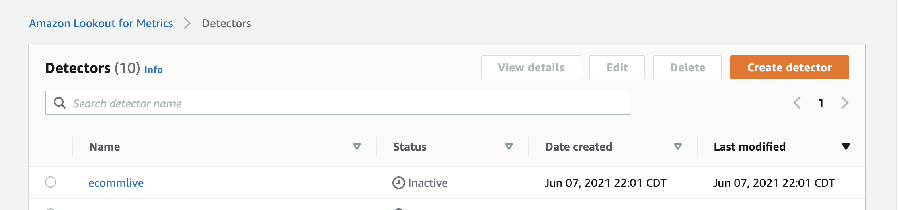

# Kinesis Data Stream Connector for Lookout for Metrics

Amazon Lookout for Metrics makes it easy to detect outliers in your time-series data, helps you determine their root causes, and enables you to quickly take action. However, one limitation you may face if you have an existing Amazon Kinesis Data Streams data pipeline is not being able to directly run anomaly detection on your data streams using Lookout for Metrics. As of
this writing, Lookout for Metrics doesn’t have native integration with Kinesis Data Streams to ingest streaming data and run anomaly detection on it. This repository contains reference implementation that simplifies and automates the streaming data ingestion process. 

This guide walks you through the steps needed to configure and deploy the reference implementation. 

## Table of Contents
&emsp;[Overview](#overview)

&emsp;[Getting Started](#getting-started)

&emsp;[Deploy Sample Data Generator](#deploy-sample-data-generator)

&emsp;[Deploy Kinesis Connector for Lookout for Metrics](#deploy-kinesis-connector-for-lookout-for-metrics)

&emsp;[Deploy and Activate Lookout for Metrics Continuous Detector](#deploy-and-activate-lookout-for-metrics-continuous-detector)
 
&emsp;[Cleanup resources](#cleanup-resources)

## Overview

The reference implementation contains three components as labeled in the architecture diagram below.  


Each component is deployed using AWS Cloud Development Kit (CDK)

1️⃣ **Streaming data generator** - [data_generator/](data_generator/)

To help you get started quickly, I have provided data generator code [src/synth_live_data_csv.py](data_generator/src/synth_live_data_csv.py) that generates sample data and write to Kinesis Data Stream at a specified time interval. The provided code generates data using ecommerce schema (platform, marketplace, event_time, views, revenue). You can also use your own Kinesis Data Stream and data, but you must update downstream processes in the architecture to process your schema.

2️⃣ **Kinesis data stream to Lookout for Metrics connector** - [l4m_connector/](l4m_connector/)

The AWS Glue Spark streaming ETL code [src/glue_spark_etl_to_s3.py](l4m_connector/src/glue_spark_etl_to_s3.py) is the core component of the solution. It contains logic to:
* ingest streaming data 
* micro-batch data by time interval
* filter dimensions and metrics columns
* deliver filtered data to S3 grouped by timestamp 

3️⃣ **Amazon Lookout for Metrics - Live Detector** - [l4m_detector/](l4m_detector/) 

After you have setup and activated data generator and the AWS Glue ETL job, the ETL script populates S3 bucket with data that is ready for Amazon Lookout for Metrics service. Follow the instructions in the section [Deploy and Activate Lookout for Metrics Continuous Detector](#deploy-and-activate-lookout-for-metrics-continuous-detector) on how to deploy a continuous detector using CDK and step-by-step instructions on activating the detector.  

## Getting Started
To get started, clone this repo to your workstation/development environment
```bash
$ git clone <<url to this repository>>
```
You need to install AWS CDK and Typescript to deploy the included **AWS Cloud Development Kit (CDK)** templates written in Typescript. For more information on using the CDK in Typescript, please see the [CDK Developer Guide](https://docs.aws.amazon.com/cdk/latest/guide/work-with-cdk-typescript.html).

1. Install **Typescript**
```shell
$ npm install -g typescript
```
>If you get a permission error, and have administrator access on your system, try `sudo npm install -g typescript`.

2. Install **AWS CDK**
```shell
$ npm install -g aws-cdk
```
>If you get a permission error, and have administrator access on your system, try `sudo npm install -g aws-cdk`.

Run the following command to verify correct installation and print the version number of the AWS CDK.
```shell
$ cdk --version
```

3. AWS credentials

You must configure your workstation with your AWS account credentials and an AWS region, if you have not already done so. This is required for CDK command line tools used for deploying the stacks in this repo. For more information, please see the "Prerequisites" section of ["Getting started with the AWS CDK"](https://docs.aws.amazon.com/cdk/latest/guide/getting_started.html).

## **Deploy Sample Data Generator**

The included CDK template in **[data_generator/](data_generator/)** directory deploys the following components:-

- **AWS Lambda function** to run python code that generates sample data. 
- **AWS EventBridge rule** that schedules Lambda function to run at every user specified time interval in minutes. 
- **Amazon Kinesis Data Stream** - Data stream that ingests data generated by the Lambda function. 

Deployment steps:

**Step 1.** From the root of the repo `kinesis_stream_connector/`, change to `data_generator/` directory

```shell 
$ cd data_generator
```
**Step 2.** Update CDK deployment parameters in [data_generator/cdk.json](data_generator/cdk.json)
```json
    "functionName": "synth_live_data_csv",
    "runFrequency": 5,
    "streamName": "ecommerce-live-data-csv",   
    "streamShards": 1,
    "lambdaLoggingLevel": "INFO",
```
`runFrequency` is the time interval in **minutes** used for scheduling the lambda function that generates sample data. This should be same or smaller than the time interval used by Lookout for Metrics Live Detector. 

**Step 3.** Install dependent libraries from package.json
```shell
$ npm install
```
**Step 4.** Deploy the stack

To synthesize CloudFormation template
```shell 
$ cdk synth 
```
To deploy the template 
```shell 
$ cdk deploy
```
You should be able to check deployment status in the AWS CloudFormation console.

> By default, the stack creates EventBridge rule in `"disabled"` status therefore Lambda function does not run until the rule is enabled. This gives you flexibility when testing the solution. Please enable the rule from AWS EventBridge console as shown below. 
Navigate to `Amazon EventBridge > Events > Rules` and locate the rule that was created by this stack. Click "Enable". 

## **Deploy Kinesis connector for Lookout for Metrics**
The included CDK template in **[l4m_connector/](l4m_connector/)** directory deploys the following components:-

- **AWS Glue Spark Streaming ETL job** that uses Kinesis Data Stream as input and S3 bucket with CSV files as output.  
> Please ensure the specified input stream name is same as the stream created in **Deploy sample Data Generator** section above.

> Glue Database and Glue table are created automatically to connect Kinesis Data Stream with Glue ETL job. If you use your own schema/data stream, please edit [stack/l4m_connector_stack.ts](l4m_connector/stack/l4m_connector_stack.ts) cdk template and update the following line of typescript code to with your schema. 
```typescript
    const fieldSchema: CfnTable.ColumnProperty[] = [
      {
          name: 'platform',
          type: 'string',
          comment: 'platform source',
      },
      {
          name: 'marketplace',
          type: 'string',
          comment: 'country code',
      },
      {
          name: 'event_time',
          type: 'timestamp',
          comment: 'event timestamp',
      },
      {
          name: 'views',
          type: 'bigint',
          comment: 'total views for the time interval',
      },
      {
        name: 'revenue',
        type: 'decimal',
        comment: 'total revenue for the time interval ',
      },
    ];
```

- **AWS Glue Spark Streaming code** the code that performs the streaming ETL is deployed from [src/glue_spark_etl_to_s3.py](l4m_connector/src/glue_spark_etl_to_s3.py). If you are using your own schema, please update the following lines of code to select output fields. You need atleast one measure (e.g. 'views') and a timestamp (e.g. 'event_time') from your source data.

```py3
datasource0 = DynamicFrame.fromDF(data_frame, glueContext,"from_data_frame").select_fields(['marketplace','event_time','views'])
```
- **Amazon S3 Bucket** S3 bucket + bucket prefix for storing output csv files from AWS Glue ETL job

Deployment steps:

**Step 1.** From the root of the repo `kinesis_stream_connector/`, change to `l4m_connector/` directory

```shell 
$ cd l4m_connector
```
**Step 2.** Update deployment parameters in [l4m_connector/cdk.json](l4m_connector/cdk.json)
```json
    "l4mInterval": 5,
    "streamName": "ecommerce-live-data-csv",  <-- specify existing kinesis stream name (created in data_generator section if you are using data generator provided in this repo)  

    "glueDBName": "ecommercedb",
    "glueTableName": "kinesis_live_data_csv",
    "sourceFormat": "csv",
  
    "bucketName": "xxxxxxxxxxxxxxxx",  <-- specify a unique (and new) bucket name 
    "bucketPrefix": "streaming-csv",
```
`l4mInterval` is the time interval in **minutes** used by Lookout for Metrics Live Detector. The Glue ETL job groups the data in S3 buckets using this time interval parameter.

`sourceFormat` is the format of S3 objects used as input to Lookout for Metrics. The provided sample code supports CSV, but the code can be modified to output JSON files as well. 

**Step 3.** Install dependent libraries
```shell
$ npm install
```
**Step 4.** Deploy the stack
To synthesize CloudFormation template
```shell 
$ cdk synth 
```
To deploy the template 
```shell 
$ cdk deploy
```
You should be able to check deployment status in the AWS CloudFormation console.

> After the CloudFormation stack completes successfully, please run AWS Glue Job from the AWS console to start processing your stream data (or sample streaming data setup in previous section) as shown below. Navigate to AWS Glue > Jobs and select the job that was created by this stack. Click "Run job" from "Action" menu.  


## **Deploy and Activate Lookout for Metrics Continuous Detector**
Check the following before proceeding to deploy the Lookout for Metrics continuous detector.
- Succesful deployment of resources in section [Deploy Sample Data Generator](#deploy-sample-data-generator). Alternatively, use an existing Kinesis Data Stream source/data schema which requires changes as described in [Deploy Kinesis Connector for Lookout for Metrics](#deploy-kinesis-connector-for-lookout-for-metrics)
> Verify AWS EventBridge rule is enabled. You can get the rule name from CloudFormation stack's output section in AWS CloudFormation console.

- Successful deployment of resources in section [Deploy Kinesis Connector for Lookout for Metrics](#deploy-kinesis-connector-for-lookout-for-metrics).  
> Verify AWS Glue ETL job is running. You can get the job name from CloudFormation stack's output section in AWS CloudFormation console.

> Verify AWS Glue ETL job is writing streaming data to S3 grouped by time interval. You can get the S3 bucket name from CloudFormation stack's output section in AWS CloudFormation console. For example, the data received for the 5-minute time interval from 22:35 to 22:40 on 06/2/2021 is stored in the s3 object/folder structure `<<bucket-name>>/streaming-csv/data/intvl_date=2021-06-02/intvl_hhmm=2235/run-1622673607777-part-r-00000`

Deployment steps:

**Step 1.** From the root of the repo `kinesis_stream_connector/`, change to `l4m_detector/` directory

```shell 
$ cd l4m_connector
```
**Step 2.** Update deployment parameters in [l4m_detector/cdk.json](l4m_detector/cdk.json)
```json
    "datasetname": "ecommerce",
    "dimensions": "marketplace",
    "metricnames": "views",
    "timestampcolumn": "event_time",
    "timeoffset": "60", 
    "timestampformat": "yyyy-MM-dd HH:mm:ss.s",
    "timezone": "UTC",
    "l4mfrequency": "PT5M",
    "bucketname": "xxxxxxxxxx",  <- specify s3 bucket name (same as the bucket created in l4m_connector section)
    "bucketprefix": "streaming-csv",
    "detectorname": "ecommlive",
```
`"dimensions"` - specify a comma separated list of input column names to be used as dimensions.

`"metricnames"` - specify a comma separated list of input colum names to be used as metrics.

`"timeoffset"` - specify offset duration in seconds. Continuous detector runs at interval+timeoffset to account for delays in data arrival. 

`"l4mfrequency"` specify the time interval for performing metrics calculation and anomaly detection. Use `PT5M, PT10M, PT1H, P1D` for 5 minutes, 10 minutes, 1 Hour and 1 Day intervals respectively.

`"bucketname"` - specify the bucket name where live data is udpated by AWS Glue ETL job

**Step 3.** Install dependent libraries
```shell
$ npm install
```
**Step 4.** Deploy the stack
To synthesize CloudFormation template
```shell 
$ cdk synth 
```
To deploy the template 
```shell 
$ cdk deploy
```
You should be able to check deployment status in the AWS CloudFormation console.

After the CloudFormation stack completes successfully, activate the detector as shown below.
Navigate to Amazon Lookout for Metrics > Detectors. Select the detector that was created by this stack. You can get the name of the detector from the CloudFormation stack's output section. 


Click on Activate button


On the confiration pop-up window, click on Activate button to confirm.


The detector starts initalizing. 


Since I have not used historical data (i.e. coldstarted live detection), the amount of time it takes for Lookout for Metrics to detect anomalies depends on the interval of your data collection as follows:
* 5 minute interval – 25 hours
* 10 minute interval – 50 hours
* 1 hour interval – 12.5 days
* 1 day interval – 14 days

To avoid coldstart, you can use historical data when creating your continuous detector. For additional details on how to generate and use historical data for live detection, please see main repo [here](https://github.com/aws-samples/amazon-lookout-for-metrics-samples/tree/main/getting_started).

Finally, detected outliers are available for review in the "Anomalies" console.


## **Cleanup resources**
From within each directory `data_generator/`, `l4m_connector/` and `l4m_detector/`, run the following command to delete the resources.
```shell 
$ cdk destroy
```
> By default, `cdk destroy` command does not delete S3 buckets and objects created by the CDK template. Please delete S3 bucket/objects directly from Amazon S3 console.  