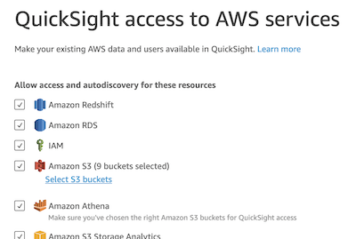

# Visualize your Amazon Lookout for Metrics Anomaly Results 
**(CDK version) Step-by-step guide to connect Amazon Lookout for Metrics to Amazon QuickSight**

CDK-based version of the AWS CloudFormation scripts presented in the [AWS Samples repository, corresponding to the published blog post](https://github.com/aws-samples/amazon-lookout-for-metrics-samples/tree/main/next_steps/l4m2quicksight).

<!--BEGIN STABILITY BANNER-->
---


> **This is a stable example. It should successfully build out of the box**
>
> This example is built on Construct Libraries marked "Stable" and does not have any infrastructure prerequisites to build.
>
---
<!--END STABILITY BANNER-->

*by Benoît de Patoul and Paul Troiano*

One of the challenges encountered by teams using Amazon Lookout for Metrics is quickly and efficiently connecting it to data visualization. The anomalies are presented as individuals in the console, each with their own graph, making it difficult to view the set as a whole. An automated, integrated solution is needed for deeper analysis.

In this example we use an Amazon Lookout for Metrics live detector built following the **Getting Started** section from the [AWS Samples GitHub Repository, Amazon Lookout for Metrics](https://github.com/aws-samples/amazon-lookout-for-metrics-samples). Once that detector is active and anomalies are generated from the dataset, we connect Lookout for Metrics to Amazon QuickSight. We create two datasets: one by joining the dimensions table with the anomaly table, and another by joining the anomaly table with the live data. We can then add these two datasets to a QuickSight analysis, where we can add charts in a single dashboard.

We can provide two types of data to the Lookout for Metrics detector: continuous and historical. The [AWS Samples GitHub Repository](https://github.com/aws-samples/amazon-lookout-for-metrics-samples) offers both, though we focus on the continuous live data. The detector monitors this live data to identify anomalies and writes the anomalies to Amazon Simple Storage Service (Amazon S3) as they're generated. At the end of a specified interval, the detector analyzes the data. Over time, the detector learns to more accurately identify anomalies based on patterns it finds.

## I. Overview of solution
The solution created is a combination of AWS services, primarily: [Amazon Lookout for Metrics](https://aws.amazon.com/lookout-for-metrics/) (L4M), [Amazon QuickSight](https://aws.amazon.com/quicksight/), [AWS Lambda](https://aws.amazon.com/lambda/), [Amazon Athena](https://aws.amazon.com/athena), [AWS Glue](https://aws.amazon.com/glue), and [Amazon Simple Storage Service](https://aws.amazon.com/s3/) (S3). Amazon Lookout for Metrics detects and sends the anomalies to AWS Lambda via an Alert. The Lambda function generates the anomaly results as csv files and saves them in S3, An Glue crawler analyzes the metadata, and creates tables in Athena. QuickSight uses Athena to query the S3 data, allowing dashboards to be built to visualize both the anomaly results and the live data.


This solution expands on the resources created in the **getting_started** section from [AWS Samples Repository, Amazon Lookout for Metrics](https://github.com/aws-samples/amazon-lookout-for-metrics-samples).
1. Create the Amazon SageMaker notebook instance (ALFMTestNotebook) and notebooks using the stack provided in the **Initial Setup** section of from [AWS Samples Repository, Amazon Lookout for Metrics](https://github.com/aws-samples/amazon-lookout-for-metrics-samples/tree/main/getting_started).
2. Once the Notebook instance has been created (~5 min.), open it from the [SageMaker console page](https://us-east-1.console.aws.amazon.com/sagemaker/home?#/notebook-instances) and select the **amazon-lookout-for-metrics-samples/getting_started** folder.
3. Create the S3 bucket and complete the data preparation using the first [notebook](https://github.com/aws-samples/amazon-lookout-for-metrics-samples/blob/main/getting_started/1.PrereqSetupData.ipynb), **1.PrereqSetupData.ipynb**. Open the notebook with the **conda_python3** kernel, if prompted.
4. This CDK example will create the remainder of the resources using two stacks, one that creates the detector, its alerts, the Glue crawler and data catalog, then another that creates the QuickSight data sets.
5. After the first stack completes, the detector will need to be activated. This can take up to 2 hours to initialize the model and detect anomalies.
6. Once some anomalies have been generated, the Glue crawler can be run.
7. After the Glue crawler has completed, the Glue data catalog is ready and the second stack can be created.
8. Finally, create a QuickSight analysis for visualization, using the two created datasets.

---

#### A Note about Parameter Security
The two parameters passed to the stacks during deployment, Your AWS account number and QuickSight username, prevent them from being stored in a code repository. However, note that they will appear in the generated CloudFormation templates, stored in your local, temporary, cdk.out path and in the CloudFormation template S3 bucket, accessible within your AWS account. Your AWS account number is used in all resource ARNs within your account, as well as the s3 bucket name for this example. The QuickSight username is specifically used for the QuickSight security policies' *Principal* clause, limiting access to the QuickSight resources. You can modify this clause within the QuickSight stacks to adjust for access to other users.

In a production application I recommend these parameters be stored in AWS Parameter Store or Secrets Manager. For this example they are used as arguments to the *deploy* command. Please ensure you are never storing nonpublic information in your code repository.

---

#### Deployment Timeframe

Since this example depends on anomalies being generated in the sample live data, it can take several hours for it to train, learn, and monitor for anomalies. The steps are broken up into sections for logical wait times. Recommend running through the detector creation (l4mDetectorRootStack) and activation (CLI or console) and putting it aside for a day. This will allow time for the anomalies to be generated and data available in s3 for the Glue crawler to pull into the catalog. Creating the QuickSight data set stacks prior to the tables being defined in the catalog will result in an error. After some anomalies have been generated (can be validated in the L4M console) deploy the QuickSight root stack (l4mQuickSightRootStack).

---

### Recent Updates

#### 04 Aug 2022
The key1 value in the python Lambda code was modified from the CloudFormation version of this example. This value is used to create the s3 prefix (folder) where the anomaly data is stored, used by the Glue crawler as the table name in the data catalog. The L1 construct for QuickSight Data Sets (CfnDataSet) requires the name of the table to be passed directly (CloudFormation allows passing a reference) and does not support underscore character. The Glue crawler was then updated to use the new path.

*old: key1 = 'anomalyResults/metricValue_AnomalyScore/'+splitdate[0]+'_'+splitdate[1]+'_metricValue_AnomalyScore.csv'*

*new: key1 = 'anomalyResults/metricValueAnomalyScore/'+splitdate[0]+'_'+splitdate[1]+'_metricValue_AnomalyScore.csv'*

---
    
## II. Getting Started Prerequisites
To go through this blog, you need an AWS account where the solution will be deployed and ensure that all resources are deployed in the same region. You need a running L4M detector built from the notebook found on the notebook instance created in the next step.

#### Create the Amazon SageMaker Notebook Instance
Create the Amazon SageMaker notebook instance and notebooks using the CloudFormation Stack, **ALFMDemo**, provided in the [getting_started, Initial Setup](https://github.com/troiano01/amazon-lookout-for-metrics-samples/tree/l4m2quicksight/getting_started#initial-setup) section.

#### Create the S3 Bucket and Prepare the Data Using the Amazon SageMaker Notebook
Open the [SageMaker console](https://console.aws.amazon.com/sagemaker/), and open the notebook instance created by the **ALFMDemo** stack, **ALFMTestNotebook**. Create the S3 bucket and complete the data preparation using the first notebook, **amazon-lookout-for-metrics-samples/getting_started/1.PrereqSetupData.ipynb**.

---
## III. CDK Prerequisites
The instructions below assume familiarity with AWS CDK. If you need to set these up, start with [the AWS CLI](https://docs.aws.amazon.com/cli/latest/userguide/cli-chap-getting-started.html) and [the AWS CDK](https://docs.aws.amazon.com/cdk/v2/guide/getting_started.html) documentation. The instructions below reference using named profiles. If you use more than one AWS environment, it is recommended to [setup named profiles on your system](https://docs.aws.amazon.com/cli/latest/userguide/cli-configure-profiles.html).

## IV. Download the GitHub Repository Folder

#### Download the l4m2quicksight-cdk folder from the Lookout For Metrics AWS Smaples Repository

1. Browse to [the DownGit Repository URL](https://github.com/MinhasKamal/DownGit).
2. Review the docs and click the link to [the DownGit web site](https://downgit.github.io).
2. Paste [the l4m2quicksight-cdk folder](https://github.com/aws-samples/amazon-lookout-for-metrics-samples/next_steps/l4m2quicksight-cdk) URL in the **GitHub Directory or File** text box.
```
https://github.com/aws-samples/amazon-lookout-for-metrics-samples/next_steps/l4m2quicksight-cdk
```

#### Create a new project folder, copy the example repository folder, and set it as your working directory.

```bash
$ mkdir <project directory>
$ cd <project directory>
$ cp <download path>/amazon-lookout-for-metrics-samples-l4m2quicksight-cdk.zip .
$ unzip amazon-lookout-for-metrics-samples-l4m2quicksight-cdk.zip
$ cd amazon-lookout-for-metrics-samples-l4m2quicksight-cdk
```

## V. Set the Environment Parameters in the cdk.json

#### Update the bucket prefix created in the *Getting Started* notebook, if it was modified.
```bash
"root-stack-dev": {
  "bucketPrefix": "ecommerce/live",
  . . .
},
```

#### Specify the Python pandas layer ARN for use in the Lambda function, for *your environment region*. This region may be different from the QuickSight account region, set below.

Browse to following URL and get the current pandas layer ARN. This sample was tested with Python 3.9. 
https://github.com/keithrozario/Klayers/tree/master/deployments/python3.9

```bash
"root-stack-dev": {
  . . .
  "pandasLayerArn": "arn:aws:lambda:<your region>:770693421928:layer:Klayers-p39-pandas:3",
  . . .
}

```

#### Add your SMS number in E.164 format. If you leave it blank, the *optional* SNS alert will be skipped in the build.

```bash
"root-stack-dev": {
  . . .
  "smsSubscriptionNumber": "",
  . . .
}

```

#### Validate your default Glue catalog name and set the name of the Glue DB you wish to use.

Validate the default catalog (e.g. 'AwsDataCatalog') using the CLI:
```bash
$ aws athena list-data-catalogs --profile <aws credentials profile>
```

Set the parameters:
```bash
"detector-stack-dev": {
  . . .
  "glueCatalogDbName": "AwsDataCatalog",
  "glueCatalogDbName": "l4m-crawler-output-db",
  . . .

```

#### Set the QuickSight account region.

The account region for QuickSight may be different than the region in which you are building. It was set when the QuickSight account was created (similar to the username).

```bash
. . .
"quicksight-stack-dev": {
  . . .
  "quickSightRegion": "<quicksight account region>"
}
. . .

```

#### Set the remaining Parameters.

The remaining parameters are set for this specific example. Recommend leaving them as set, adjusting only once you are
familiar with the service and testing other configurations.

```bash
{
  "app": "npx ts-node --prefer-ts-exts bin/l4m2quicksight-cdk.ts",

 "context": {
    "detector-stack-dev": {
      "bucketPrefix": "ecommerce/live",
      "pandasLayerArn": "arn:aws:lambda:us-east-1:770693421928:layer:Klayers-p39-pandas:3",
      "smsSubscriptionNumber": "",
      "glueCatalogDbName": "AwsDataCatalog",
      "glueCatalogDbName": "l4m-crawler-output-db",
      "detectorFrequency": "PT1H",
      "lambdaHandlerName": "lambda.lambda_handler",
      "lambdaRelativePath": "../function/lambda.zip",
      "lambdaMemorySize": 128,
      "lambdaDuration": 5,
      "metrics": ["views", "revenue"],
      "dimensions": ["platform", "marketplace"],
      "timestampFormat": "yyyy-MM-dd HH:mm:ss",
      "timestampColumn": "timestamp",
      "timezone": "UTC"
    },

    "quicksight-stack-dev": {
      "quickSightRegion": "<quicksight account region>"
    }
  }
}

```

## VI. Configure the CDK Environment

This will install the necessary CDK resources, the example's dependencies, and then generate the CloudFormation templates. To build this app, you need to be in this example's root folder to run the following:

```bash
$ cd <project directory>/l4m2quicksight-cdk
$ npm install aws-cdk-lib
$ cdk bootstrap --profile <aws credentials profile>
```

*cdk synth* executes the app, generating the CloudFormation scripts and storing them in cdk.out. Recommend runnng this prior to deploying, to correct any errors.

```bash
$ cdk synth --profile <aws credentials profile> --all
```

## VII. Deploy the Amazon L4M Detector and AWS Glue Crawler

This will deploy the L4M detector and AWS Glue resources to your AWS Account.

```bash
$ cdk deploy --profile <aws credentials profile> l4mDetectorRootStack --parameters AWSAccountNumber=<account number>
```

### Activate the Detector
Before proceeding to the second stack, the detector needs to be activated. After the above root stack is deployed, wait for the detector creation to complete (will show status as *INACTIVE*). Activation initializes the detector and will be ready after the model has completed its learning cycle. **The learning cycle can take an hour**.

#### Option 1: Using the AWS CLI:

Find the ARN of the new detector using:

```bash
aws lookoutmetrics list-anomaly-detectors --profile <aws credentials profile> 
```
Activate the detector using the ARN:

```bash
aws lookoutmetrics activate-anomaly-detector --profile <aws credentials profile> \    
  --anomaly-detector-arn=<Detector ARN>
```

#### Option 2: Using the console:

- Open the [**Amazon Lookout for Metrics console**](https://console.aws.amazon.com/lookoutmetrics) and expand the menu on the left.
- Choose **Detectors** from the menu and click on the name of the newly created Detector.
- Click **Activate** in the upper right and then click **Activate** again on the dialog that opens.

### Run the AWS Glue Crawler to Populate the Glue Data Catalog

**Note:** If you run the Glue Crawler job prior to anomalies being generated, the anomaly tables will not be in the data catalog when QuickSight tries to access them and will generate a SQL error. **Anomaly generation could take a couple hours**.

The Glue crawler job will take a few minutes.

#### Option 1: Using the AWS CLI:
Find the name of the new Glue crawler using:

```bash
aws glue list-crawlers --profile <aws credentials profile>
```

Run the crawler using the name:

```bash
aws glue start-crawler --profile <aws credentials profile> \
  --name=<crawler name>
```

#### Option 2: Using the console:

Open the [**AWS Glue Console**](https://console.aws.amazon.com/glue/) and choose **Crawlers** from the left menu. Click the checkbox next to your crawler (L4MCrawler) and then the **Run Crawler** button, above the list. It will run for a few minutes and then show a **Ready** status when completed.


## VIII. Deploy the Amazon QuickSight Resource Stack

Before starting this step, navigate to [**Amazon QuickSight**](https://quicksight.aws.amazon.com/) and create an account if you do not have one. Ensure you have access to the corresponding services (Athena and S3) by clicking on your account name on the top right. Choose **manage QuickSight**, and click on **Security and Permissions** where you can add the necessary services. In order to access the s3 bucket for this example, be sure to explicitly choose the s3 bucket created above.

**Ensure both *Amazon Athena* and *Amazon S3* are selected:** </br>

</br>

**Click on *Select S3 buckets*:** </br>

</br>

**Choose the bucket created using the notebook (the bucket for this example):** </br>

</br>

---

This step will deploy the QuickSight resources to your AWS Account. Once deployed you will have two QuickSight data sets available with the anomaly data and can then build analyses and dashboards within the QuickSight console.

```bash
$ cdk deploy --profile <aws credentials profile> l4mQuickSightRootStack \
  --parameters QuickSightUserName=<QuickSight Username>
```

## IX. Create the Amazon QuickSight Analysis for Dashboard Creation

With the two Amazon QuickSight datasets created, open the [**Amazon QuickSight console**](https://quicksight.aws.amazon.com/), and choose **Analysis** from the left menu. Click on **New analysis** in the upper right. Select the first of the two datasets created, **L4MQuickSightDataSetWithLiveData**, and click **Create analysis** in the small dialog window that opened.

**Note**: In your analysis, you will want to create a calculated field called *timestamp*, based on the date-time string field, *dimensionstimestamp*. The transform in the code currently generates an error, but will be updated soon.

**Dataset Lists:**</br>

</br>

**Create Analysis:**</br>

</br>

**Add the calculated field:**</br>

</br>

The QuickSight analysis was initially created with only the first dataset. To add the second, click the **pencil** icon next to **Dataset** in the upper left, and choose **Add dataset** from the dialog window that opens. Choose the second dataset and click **Select**. You will then be able to use either dataset for creating charts by choosing the dropdown under **Dataset**.

**Edit the included dataset list:**</br>


**Add the second dataset:**</br>


**Select the second dataset:**</br>


## X. Dataset Metrics

You have successfully created a QuickSight analysis from Lookout for Metrics inference results and the live data. Two datasets are in QuickSight for you to use: **L4M_Visualization_dataset_with_liveData** dataset and **L4M_Visualization_dataset_with_dimensionContribution**.

The **L4M_Visualization_dataset_with_liveData** dataset includes the following metrics:
- The **timestamp** is the date + time of the live data passed to L4M.
- The **views** is the value of the views metric.
- The **revenue** is the value of the revenue metric.
- The **platform, marketplace, revenueAnomalyMetricValue, viewsAnomalyMetricValue, revenueGroupScore, and viewsGroupScore** are explained below. These metrics are part of the two datasets. 

The **L4M_Visualization_dataset_with_dimensionContribution** dataset includes the following metrics:
- The **timestamp** is the date + time of when the anomaly was detected.
- The **metricName** is the metric(s) you are monitoring. 
- The **dimensionName** is the dimension within the metric.
- The **dimensionValue** is the value of the dimension.
- The **valueContribution** is the percentage on how much the dimensionValue affects the anomaly, when detected.

The following image shows these five metrics on the anomaly dashboard of the Lookout for Metrics detector.


The following metrics are part of both datasets:
- The **platform** is the platform where the anomaly happened. 
- The **marketplace** is the marketplace where the anomaly happened.
- The **revenueAnomalyMetricValue** and **viewsAnomalyMetricValue** are the corresponding values of the metric when the anomaly was detected (in this situation, the metrics are revenue or views).
- The **revenueGroupScore** and **viewsGroupScore** are the severity scores for each metric for the detected anomaly. 

To better understand these last metrics, you can review the CSV files created by the Lambda function in your S3 bucket where you saved the **anomalyResults/metricValue_AnomalyScore**.

## XI. Next Steps

The next step is to build the dashboards for the data you want to see. This post doesn’t include an explanation on creating QuickSight charts. If you’re new to QuickSight, refer to [**Getting Started with Data Analysis in Amazon QuickSight documentation**](https://docs.aws.amazon.com/quicksight/latest/user/getting-started.html) for an introduction. The following screenshots show examples of basic dashboards. For more information, check out the QuickSight workshops. For further information there is an [**official workshop on Amazon QuickSight**](https://learnquicksight.workshop.aws/en/).


## XII. Conclusion

The anomalies are presented individually on the Lookout for Metrics console, each with their own graph, making it difficult to view the set as a whole. An automated, integrated solution is needed for deeper analysis. In this post, we used a Lookout for Metrics detector to generate anomalies, and connected the data to QuickSight to create visualizations. This solution enables us to conduct deeper analysis into anomalies and have them all in one single place/dashboard. 

As a next step, this solution could as well be expanded by adding an extra dataset and combine anomalies from multiple detectors. You could also adapt the Lambda function. The Lambda function contains the code that generates the data sets and variable names that we use for the QuickSight dashboards. You can adapt this code to your particular use case by changing the data sets itself or the variable names that make more sense to you.

## XIII. Cleanup

Once completed with the walkthrough steps, this will destroy/remove your stacks from your AWS Account.
1. Manually delete the L4M detector you created in the above steps.
2. Once it is fully deleted (takes a few minutes), remove the supporting AWS resources using the 'CDK destroy' command.
```bash
$ cdk destroy --profile <aws credentials profile> --all
```
