#### Add Link to blog post
-------------
# Visualize your Amazon Lookout for Metrics Anomaly Results
## Step-by-step guide to connect Amazon Lookout for Metrics to Amazon QuickSight 
*by Benoît de Patoul and Paul Troiano*

One of the challenges encountered by teams using Amazon lookout for Metrics is quickly and efficiently connecting it to data visualization. The anomalies are presented as individuals in the console, each with their own graph, making it difficult to view the set as a whole. An automated, integrated solution is needed for deeper analysis.

In this blog post we will use an Amazon Lookout for Metrics live detector built following the getting_started section from AWS Samples Repository, Amazon Lookout for Metrics. Once that detector is active and anomalies are generated from the dataset, we’ll continue the steps to connect Amazon Lookout for Metrics to Amazon QuickSight. Two datasets will be created, one by joining the dimensions 
table with the anomaly table and another by joining the anomaly table with the live data. These two datasets can then be added to an Amazon QuickSight Analysis where charts can be added in a single dashboard.

Two types of data can be provided to the Amazon Lookout for Metrics detector, continuous and historical. The AWS Samples Repository this is based on presents both, though we will focus on the continuous live data. The detector monitors this live data to identify anomalies and writes to Amazon S3 as it is generated. At the end of a specified interval, the detector analyzes the data. Over time, the detector learns to more accurately identify anomalies based on patterns it finds.

Amazon Lookout for Metrics uses machine learning (ML) to automatically detect and diagnose anomalies in business and operational data, such as a sudden dip in sales revenue or customer acquisition rates. The service is now generally available as of March 25, 2021. It automatically inspects and prepares data from a variety of sources to detect anomalies with greater speed and accuracy than traditional methods used for anomaly detection. You can also provide feedback on detected anomalies to tune the results and improve accuracy over time. Amazon Lookout for Metrics makes it easy to diagnose detected anomalies by grouping together anomalies that are related to the same event and sending an alert that includes a summary of the potential root cause. It also ranks anomalies in order of severity so that you can prioritize your attention to what matters the most to your business.

Amazon QuickSight lets you easily create and publish interactive business intelligence (BI) dashboards as well as receive answers in seconds through natural language queries. QuickSight’s serverless, highly scalable dashboards can be accessed from any device, and seamlessly embedded into your applications, portals, and websites.

## Overview of solution
The solution created is a combination of AWS services, primarily: Amazon Lookout for Metrics (L4M), Amazon QuickSight, AWS Lambda, Amazon Athena, AWS Glue and Amazon Simple Storage Service (S3). Amazon Lookout for Metrics detects and sends the anomalies to AWS Lambda via an Alert. The AWS Lambda function will generate the anomaly results as csv files and save them in Amazon S3, An AWS Glue Crawler will analyze the metadata, and create tables in Amazon Athena. An Amazon QuickSight Athena Data Source and Datasets will prepare the results for use in an Amazon QuickSight Analysis and Dashboard to visualize both the anomaly results and the live data.

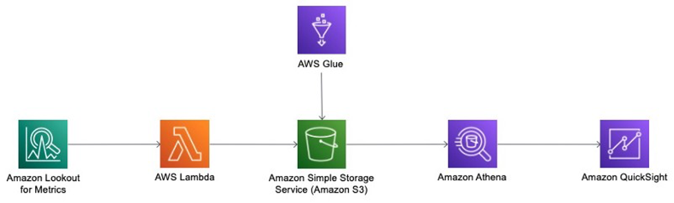

To go through this example, have an AWS account where the solution will be deployed. This solution will expand on the resources created in the getting_started section from AWS Samples Repository, Amazon Lookout for Metrics The steps below have options to create the resources using either the AWS Console or launching the provided AWS CloudFormation stacks.
1. Create the Amazon SageMaker notebook instance (ALFMTestNotebook) and notebooks using the stack provided in the Initial Setup section (ALFMDemo).
2. Create the Amazon S3 Bucket and complete the data preparation using the first notebook (1.PrereqSetupData.ipynb).
3. We will skip the second notebook as it is focused on backtesting data.
4. If you will be walking through the example using the AWS Console, create the Amazon Lookout for Metrics live detector and its alert using the third notebook (3.GettingStartedWithLiveData.ipynb).
5. If you will be using the provided CloudFormation stacks, the third notebook isn’t required. The detector and its alert will be created using the Launch Stack link.
6. Once the L4M live detector is created, you will need to activate it from the console. This can take up to 2 hours to initialize the model and detect anomalies.
7. Deploy an Amazon Lambda function, using Python with a pandas library layer, and create an alert to launch it, attached to the live detector.
8. Use the combination of Amazon Athena and AWS Glue to discover and prepare the data for QuickSight. Once the Glue crawler is ready, you will need to start it via the console.
9. Create the Amazon QuickSight Data Source and Datasets.
10. Finally, create an Amazon QuickSight Analysis for visualization, using the datasets. The CloudFormation scripts, below would be typically be run as a set of nested stacks in a production environment. They are provided individually here to facilitate a step-by-step walk through.

The CloudFormation scripts, below would be typically be run as a set of nested stacks in a production environment. They are provided individually here to facilitate a step-by-step walk through.

Instructions using AWS CloudFormation are below. Console-based instructions are located here.

## Prerequisites
Ensure the steps below are completed in the same region where your Amazon Lookout for Metrics live detector is created. 

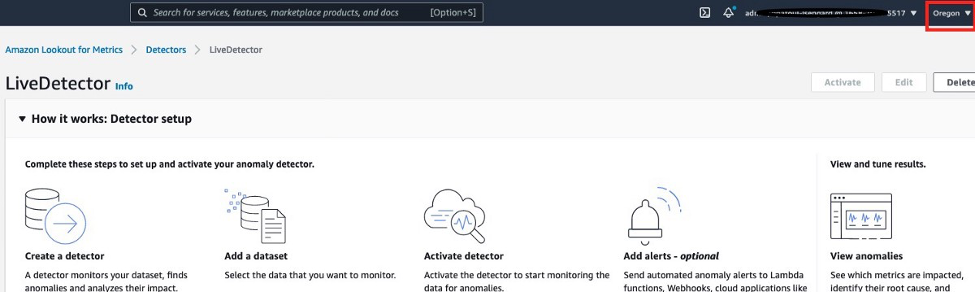

### Create the Amazon SageMaker Notebook Instance
Create the Amazon SageMaker notebook instance and notebooks using the CloudFormation Stack (ALFMDemo) provided in the [getting_started, Initial Setup](https://github.com/troiano01/amazon-lookout-for-metrics-samples/tree/l4m2quicksight/getting_started#initial-setup) section.

### Create the S3 Bucket and Prepare the Data Using the Amazon SageMaker Notebook
Open the [Amazon SageMaker console](https://console.aws.amazon.com/sagemaker/), and open the notebook instance created by the ALFMDemo stack (ALFMTestNotebook). Create the Amazon S3 Bucket and complete the data preparation using the first notebook (located at amazon-lookout-for-metrics-samples/getting_started/1.PrereqSetupData.ipynb).

### Create the Live Detector
From the objects created in the above steps, you will need:
- S3 Bucket: `<Account Number>-lookoutmetrics-lab` 
- Role ARN: `arn:aws:iam::<Account Number>:role/L4MTestRole`
- The anomaly detection frequency: choose `PT1H` (hourly)

The [*L4MLiveDetector.yaml*](1-L4MLiveDetector.yaml) CloudFormation script creates the Lookout for Metrics Anomaly Detector resource with its source pointing to the live data in the S3 bucket created above.
- Launch the stack from the link below and update the parameters with the values from above.

 
- On the Specify stack details page, add the values from above, give it a Stack name (ex. L4MLiveDetector), and click *Next*
- On the Configure stack options page, leave everything as-is and click *Next*
- On the Review page, leave everything as-is and click *Create Stack*

### Resource Cleanup
Before proceeding to Step 1, stop your SageMaker notebook instance, as it is no longer needed, to ensure no unnecessary costs are incurred.

## Step 1: Setting up the AWS Lambda function

### Create the AWS Lambda Function and Alert Using CloudFormation
First, download the latest version of the Lambda function code (L4MVersion3.zip) similar to the console instructions, however in this case move it to the S3 bucket where it can be accessed by the CloudFormation code.

Open the S3 Console and choose the bucket.

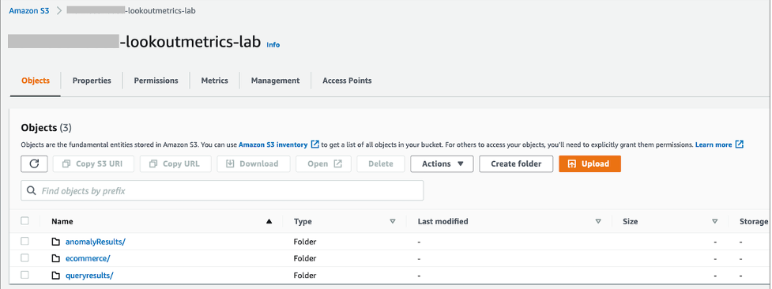

Create a new folder, lambdaCode, and upload the lambda code archive file.

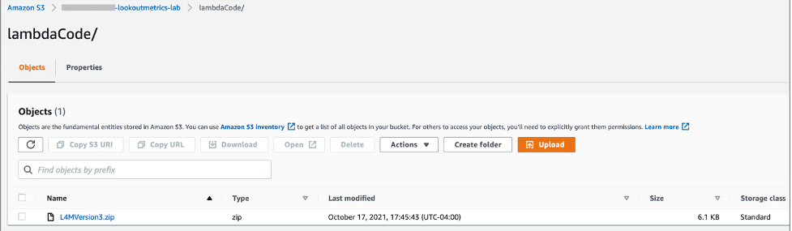

The *L4MLambdaFunction.yaml* CloudFormation script creates the Lambda Function and Alert resources using the code archive stored in the S3 bucket.
- Launch the stack from the link below and update the parameters with the values from above.

 
- On the Specify stack details page, add the values from above, give it a Stack name (ex. L4MLambdaFunction), and click *Next*
- On the Configure stack options page, leave everything as-is and click *Next*
- On the Review page, check the IAM Role creation acknowledgement, leave everything else as-is, and click *Create Stack*

### Activate the Detector
Before proceeding to Step 2, the Detector needs to be activated from the console.
- Open the Amazon Lookout for Metrics console and expand the menu on the left.
- Choose Detectors from the menu and click on the name of the newly created Detector.
- Click Activate in the upper left and then click Activate again on the dialog that opens.
- Activation initializes the detector and will complete after the model has completed its learning cycle. This can take up to 2 hours.

## Step 2: Preparing the data for Amazon QuickSight

### Create the AWS Glue Crawler Using CloudFormation
The *L4MGlueCrawler.yaml* CloudFormation script creates the AWS Glue Crawler, its associated IAM Role, and the output Athena database.
- Launch the stack from the link below and update the parameters with the values from above.

 
- On the Specify stack details page, add the values from above, give it a Stack name (ex. L4MGlueCrawler), and click *Next*.
- On the Configure stack options page, leave everything as-is and click *Next*.
- On the Review page, check the IAM Role creation acknowledgement, leave everything else as-is, and click *Create Stack*.
- Once the AWS Glue Crawler has been created, it will need to be run from the console (or AWS CLI) before moving on to the next steps.

### Run the AWS Glue Crawler
Open the AWS Glue Console and choose Crawlers from the left menu. Click the checkbox next to your crawler (L4MCrawler) and then the Run Crawler button above the list. It will run for a few minutes and then show a Ready status when completed.

## Step 3: Visualize your data in Amazon QuickSight
Navigate to Amazon QuickSight, create an account if you do not have one. You need to make sure to have access to the corresponding services (Athena and S3) by clicking on your account name on the top right, manage QuickSight, and click on Security and Permissions where you can add the necessary services. 

### Create the Amazon QuickSight Data Source Using CloudFormation
The L4MQuickSightDataSource.yaml CloudFormation script creates the AWS Glue Crawler, its associated IAM Role, and the output Athena database.
- Launch the stack from the link below and update the parameters with the values from above.

 
- On the Specify stack details page, add the values from above, give it a Stack name (ex. L4MGlueCrawler), and click Next
- On the Configure stack options page, leave everything as-is and click Next
- On the Review page, check the IAM Role creation acknowledgement, leave everything else as-is, and click Create Stack

### Create the First Amazon QuickSight Dataset Using CloudFormation
The L4MQuickSightDataSet1.yaml CloudFormation script creates an Amazon QuickSight Dataset for that joins the dimensions table with the anomaly table.
- Launch the stack from the link below and update the parameters with the values from above.

- On the Specify stack details page, add the values from above, give it a Stack name (ex. L4MGlueCrawler), and click Next
- On the Configure stack options page, leave everything as-is and click Next
- On the Review page, check the IAM Role creation acknowledgement, leave everything else as-is, and click Create Stack

### Create the Second Amazon QuickSight Dataset Using CloudFormation
The L4MQuickSightDataSet1.yaml CloudFormation script creates the Amazon QuickSight Dataset that joins the anomaly table with the live data table.
- Launch the stack from the link below and update the parameters with the values from above.

- On the Specify stack details page, add the values from above, give it a Stack name (ex. L4MGlueCrawler), and click Next
- On the Configure stack options page, leave everything as-is and click Next
- On the Review page, check the IAM Role creation acknowledgement, leave everything else as-is, and click Create Stack

### Create the Amazon QuickSight Analysis for Dashboard Creation
With the two Amazon QuickSight datasets created, open the Amazon QuickSight console, and choose Analysis from the left menu. Click on New analysis in the upper right. Select the first of the two datasets created, L4MQuickSightDataSetWithLiveData, and click Create analysis in the small dialog window that opened.

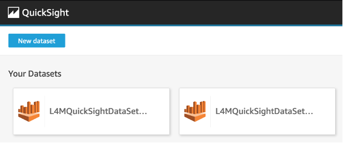

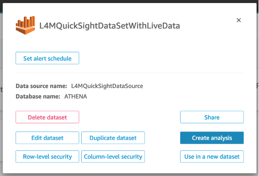

The QuickSight Analysis was initially created with only the first dataset. To add the second, click the pencil icon next to Dataset in the upper left, and choose Add dataset from the dialog window that opened. Choose the second dataset and click Select. You will then be able to use either dataset for creating charts by choosing the dropdown under Dataset.

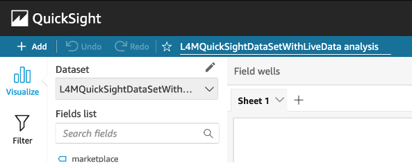

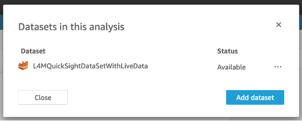

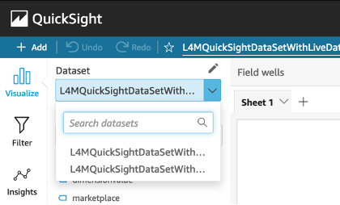

## Next Steps
You have now all the data to start building your own dashboards. This blog post will not go through an explanation on creating Amazon QuickSight charts. If you are new to QuickSight, you can walk through the Getting Started with Data Analysis in Amazon QuickSight documentation for an introduction. As an example, the images below show basic dashboards. For further information there is an official workshop on Amazon QuickSight.

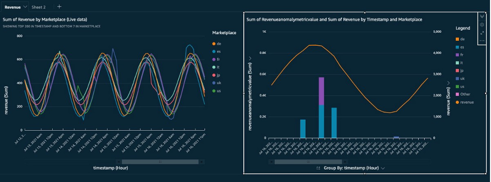

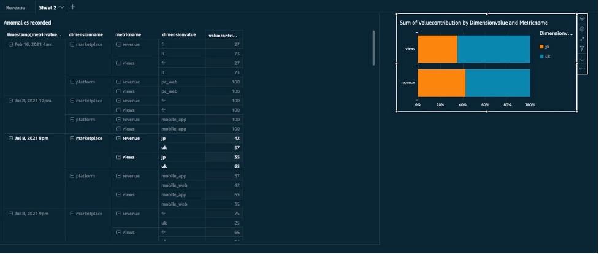

