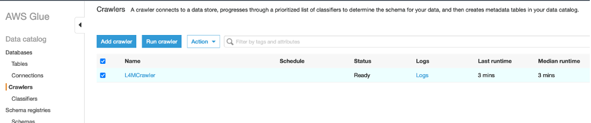
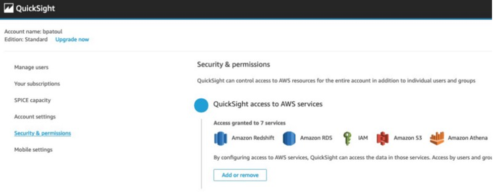

#### Add Link to blog post
-------------
# Visualize your Amazon Lookout for Metrics Anomaly Results
## Step-by-step guide to connect Amazon Lookout for Metrics to Amazon QuickSight 
*by Benoît de Patoul and Paul Troiano*

One of the challenges encountered by teams using Amazon Lookout for Metrics is quickly and efficiently connecting it to data visualization. The anomalies are presented as individuals in the console, each with their own graph, making it difficult to view the set as a whole. An automated, integrated solution is needed for deeper analysis.

In this example we will use an Amazon Lookout for Metrics live detector built following the **getting_started** section from [AWS Samples Repository, Amazon Lookout for Metrics](https://github.com/aws-samples/amazon-lookout-for-metrics-samples). Once that detector is active and anomalies are generated from the dataset, we will continue the steps to connect Amazon Lookout for Metrics to Amazon QuickSight. Two datasets will be created, one by joining the dimensions table with the anomaly table and another by joining the anomaly table with the live data. These two datasets can then be added to an Amazon QuickSight Analysis where charts can be added in a single dashboard. 

Two types of data can be provided to the Amazon Lookout for Metrics detector, continuous and historical. The [AWS Samples Repository](https://github.com/aws-samples/amazon-lookout-for-metrics-samples) presents both, though we focus on the continuous live data. The detector monitors this live data to identify anomalies and writes to Amazon S3 as it is generated. At the end of a specified interval, the detector analyzes the data. Over time, the detector learns to more accurately identify anomalies based on patterns it finds.

## Overview of solution
The solution created is a combination of AWS services, primarily: [Amazon Lookout for Metrics](https://aws.amazon.com/lookout-for-metrics/) (L4M), [Amazon QuickSight](https://aws.amazon.com/quicksight/), [AWS Lambda](https://aws.amazon.com/lambda/), [Amazon Athena](https://aws.amazon.com/athena), [AWS Glue](https://aws.amazon.com/glue), and [Amazon Simple Storage Service](https://aws.amazon.com/s3/) (S3). Amazon Lookout for Metrics detects and sends the anomalies to AWS Lambda via an Alert. The Lambda function generates the anomaly results as csv files and saves them in S3, An Glue crawler analyzes the metadata, and creates tables in Athena. QuickSight uses Athena to query the S3 data, allowing dashboards to be built to visualize both the anomaly results and the live data.

This solution will expand on the resources created in the **getting_started** section from [AWS Samples Repository, Amazon Lookout for Metrics](https://github.com/aws-samples/amazon-lookout-for-metrics-samples).
1. Create the Amazon SageMaker notebook instance (ALFMTestNotebook) and notebooks using the stack provided in the **Initial Setup** section of from [AWS Samples Repository, Amazon Lookout for Metrics](https://github.com/aws-samples/amazon-lookout-for-metrics-samples/tree/main/getting_started).
2. Once the Notebook instance has been created (~5 min.), open it from the [SageMaker console page](https://us-east-1.console.aws.amazon.com/sagemaker/home?#/notebook-instances) and select the **amazon-lookout-for-metrics-samples/getting_started** folder.
3. Create the S3 bucket and complete the data preparation using the first [notebook](https://github.com/aws-samples/amazon-lookout-for-metrics-samples/blob/main/getting_started/1.PrereqSetupData.ipynb), **1.PrereqSetupData.ipynb**. Open the notebook with the **conda_python3** kernel, if prompted.
4. We will skip the second [notebook](https://github.com/aws-samples/amazon-lookout-for-metrics-samples/blob/main/getting_started/2.BacktestingWithHistoricalData.ipynb) as it is focused on backtesting data.
5. If you will be using the provided CloudFormation stacks, the third [notebook](https://github.com/aws-samples/amazon-lookout-for-metrics-samples/blob/main/getting_started/3.GettingStartedWithLiveData.ipynb) isn’t required. The detector and its alert will be created using the **Launch Stack** link in the steps below.
6. Once the L4M live detector is created, you will need to activate it from the console. This can take up to 2 hours to initialize the model and detect anomalies.
7. Deploy an Lambda function, using python with a pandas library layer, and create an alert attached to the live detector to launch it.
8. Use the combination of Athena and Glue to discover and prepare the data for QuickSight.
9. Create the QuickSight data source and datasets.
10. Finally, create a QuickSight analysis for visualization, using the datasets.

The CloudFormation scripts below would be typically be run as a set of nested stacks in a production environment. They are provided individually to facilitate a step-by-step walk through.

## Prerequisites
To go through this blog, you need an AWS account where the solution will be deployed and ensure that all resources you deploy are in the same region. You need a running L4M detector built from the notebook found on the notebook instance created in the next step.

### Create the Amazon SageMaker Notebook Instance
Create the Amazon SageMaker notebook instance and notebooks using the CloudFormation Stack, **ALFMDemo**, provided in the [getting_started, Initial Setup](https://github.com/troiano01/amazon-lookout-for-metrics-samples/tree/l4m2quicksight/getting_started#initial-setup) section.

### Create the S3 Bucket and Prepare the Data Using the Amazon SageMaker Notebook
Open the [SageMaker console](https://console.aws.amazon.com/sagemaker/), and open the notebook instance created by the **ALFMDemo** stack, **ALFMTestNotebook**. Create the S3 bucket and complete the data preparation using the first notebook, **amazon-lookout-for-metrics-samples/getting_started/1.PrereqSetupData.ipynb**.

### Create the Live Detector
From the objects created in the above steps, you will need:
- S3 bucket: `<Account Number>-lookoutmetrics-lab` 
- Role ARN: `arn:aws:iam::<Account Number>:role/L4MTestRole`
- The anomaly detection frequency: choose `PT1H` (hourly)

The [**L4MLiveDetector.yaml**](src/1-L4MLiveDetector.yaml) CloudFormation script creates the Lookout for Metrics anomaly detector resource with its source pointing to the live data in the S3 bucket created above.
- Launch the stack from the link below and click **Next** on the **Create stack** page.

 
- On the **Specify stack details** page, add the values from above to the parameters and give it a **Stack name** (ex. L4MLiveDetector), and click **Next**.
- On the **Configure stack options** page, leave everything as-is and click **Next**.
- On the **Review** page, leave everything as-is and click **Create Stack**.

### Create the Live Detector SMS Alert Using CloudFormation
This step is optional. The alert is presented as an example, with no impact on the dataset creation. The [*L4MLiveDetectorAlert.yaml*](src/2-L4MLiveDetectorAlert.yaml) CloudFormation script creates the Lookout for Metrics Anomaly Detector Alert resource with an SMS target. 
- Launch the stack from the link below and click **Next** on the **Create stack** page.

- On the **Specify stack details** page, update the **SMS phone number**, give it a **Stack name** (ex. L4MLiveDetectorAlert), and click **Next**
- On the **Configure stack options** page, leave everything as-is and click **Next**.
- On the **Review** page, check the IAM Role creation acknowledgement, leave everything else as-is, and click **Create Stack**.

### Resource Cleanup
Before proceeding to Step 1, stop your SageMaker notebook instance to ensure no unnecessary costs are incurred. It is no longer needed.

## Step 1: Setting up the AWS Lambda function

### Create the AWS Lambda Function and Alert Using CloudFormation
The [*L4MLambdaFunction.yaml*](src/3-L4MLambdaFunction.yaml) CloudFormation script creates the Lambda Function and Alert resources as well as the using the function code archive stored in the same S3 bucket.
- Launch the stack from the link below and update the parameters.

 
- On the Specify stack details page update the pandas Lambda Layer ARN, give it a Stack name (ex. L4MLambdaFunction), and click *Next*
- On the Configure stack options page, leave everything as-is and click *Next*
- On the Review page, check the IAM Role creation acknowledgement, leave everything else as-is, and click *Create Stack*

### Activate the Detector
Before proceeding to Step 2, the Detector needs to be activated from the console.
- Open the [Amazon Lookout for Metrics console](https://console.aws.amazon.com/lookoutmetrics) and expand the menu on the left.
- Choose Detectors from the menu and click on the name of the newly created Detector.
- Click *Activate* in the upper left and then click *Activate* again on the dialog that opens.
- Activation initializes the detector and will be ready after the model has completed its learning cycle. This can take up to 2 hours.

## Step 2: Preparing the data for Amazon QuickSight

### Create the AWS Glue Crawler
The [*L4MGlueCrawler.yaml*](src/4-L4MGlueCrawler.yaml) CloudFormation script creates the AWS Glue Crawler, its associated IAM Role, and the output Athena database.
- Launch the stack from the link below and click *Next* on the Create stack page.

 
- On the Specify stack details page give it a Stack name (ex. L4MGlueCrawler) and click *Next*.
- On the Configure stack options page, leave everything as-is and click *Next*.
- On the Review page, check the IAM Role creation acknowledgement, leave everything else as-is, and click *Create Stack*.
- Once the AWS Glue Crawler has been created, it will need to be run from the console (or AWS CLI) before moving on to the next steps.

### Run the AWS Glue Crawler
Open the [AWS Glue Console](https://console.aws.amazon.com/glue/) and choose Crawlers from the left menu. Click the checkbox next to your crawler (L4MCrawler) and then the *Run Crawler* button above the list. It will run for a few minutes and then show a *Ready* status when completed.

## Step 3: Visualize your data in Amazon QuickSight
Before starting this step, [navigate to Amazon QuickSight](https://quicksight.aws.amazon.com/) and create an account if you do not have one. Ensure you have access to the corresponding services (Athena and S3 bucket) by clicking on your account name on the top right, manage QuickSight, and click on Security and Permissions where you can add the necessary services. 

### Create the Amazon QuickSight Data Source
The [*L4MQuickSightDataSource.yaml*](src/5-L4MQuickSightDataSource.yaml) CloudFormation script creates the Amazon QuickSight Athena Data Source.
- Launch the stack from the link below and click *Next* on the Create stack page.

 
- On the Specify stack details page, add your QuickSight username, give it a Stack name (ex. L4MQuickSightDataSource), and click *Next*.
- On the Configure stack options page, leave everything as-is and click *Next*.
- On the Review page leave everything as-is and click *Create Stack*.

### Create the First Amazon QuickSight Dataset
The [*L4MQuickSightDataSet1.yaml*](src/6-L4MQuickSightDataSet1.yaml) CloudFormation script creates an Amazon QuickSight Dataset that joins the dimensions table with the anomaly table.
- Launch the stack from the link below and update the parameter value.

- On the Specify stack details page, add your QuickSight username, give it a Stack name (ex. L4MQuickSightDataSet1), and click *Next*.
- On the Configure stack options page, leave everything as-is and click *Next*.
- On the Review page leave everything as-is and click *Create Stack*.

### Create the Second Amazon QuickSight Dataset
The [*L4MQuickSightDataSet2.yaml*](src/6-L4MQuickSightDataSet2.yaml) CloudFormation script creates the Amazon QuickSight Dataset that joins the anomaly table with the live data table.
- aunch the stack from the link below and click Next on the Create stack page.

- On the Specify stack details page, add your QuickSight username, give it a Stack name (ex. L4MQuickSightDataSet2), and click *Next*.
- On the Configure stack options page, leave everything as-is and click *Next*.
- On the Review page leave everything as-is and click *Create Stack*.

### Create the Amazon QuickSight Analysis for Dashboard Creation
With the two Amazon QuickSight datasets created, open the [Amazon QuickSight console](https://quicksight.aws.amazon.com/), and choose Analysis from the left menu. Click on New analysis in the upper right. Select the first of the two datasets created, L4MQuickSightDataSetWithLiveData, and click Create analysis in the small dialog window that opened.

The QuickSight Analysis was initially created with only the first dataset. To add the second, click the pencil icon next to *Dataset* in the upper left, and choose *Add dataset* from the dialog window that opened. Choose the second dataset and click *Select*. You will then be able to use either dataset for creating charts by choosing the dropdown under *Dataset*.

## Conclusion
You have successfully created a QuickSight analysis from L4M inference results and the live data. Two datasets are in QuickSight for you to use: The *L4M_Visualization_dataset_with_liveData* dataset and the *L4M_Visualization_dataset_with_dimensionContribution* dataset.

The *L4M_Visualization_dataset_with_liveData* dataset includes the following metrics:
- The *timestamp* is the date + time of the live data passed to L4M.
- The *views* is the value of the views metric.
- The *revenue* is the value of the revenue metric.
- The *platform, marketplace, revenueAnomalyMetricValue, viewsAnomalyMetricValue, revenueGroupScore and viewsGroupScore* are explained below. These metrics are part of the two datasets. 

The *L4M_Visualization_dataset_with_dimensionContribution* dataset includes the following metrics:
- The *timestamp* is the date + time of when the anomaly was detected.
- The *metricName* is the metric(s) you are monitoring. 
- The *dimensionName* is the dimension within the metric.
- The *dimensionValue* is the value of the dimension.
- The *valueContribution* is the percentage on how much is the dimensionValue affecting the anomaly when detected.

The following image shows these 5 metrics together. It is an example from the Anomaly dashboard of the L4M detector.

The following metrics are part of the two datasets:
- The *platform* is the platform where the anomaly happened. 
- The *marketplace* is the marketplace where the anomaly happened.
- The *revenueAnomalyMetricValue and the viewsAnomalyMetricValue* are the corresponding values of the metric when the anomaly was detected (in this situation, the metrics are revenue or views).
- The *revenueGroupScore and the viewsGroupScore* are the severity scores for each metric for the detected anomaly. 

Note: To better understand these last metrics, please go have a look on the csv files created by the Lambda function in your S3 bucket where you saved the anomalyResults/metricValue_AnomalyScore

The next step is to build the dashboards for the data you would like to see. This blog will not go through an explanation on creating Amazon QuickSight charts. If you are new to QuickSight, you can walk through the [Getting Started with Data Analysis in Amazon QuickSight documentation](https://docs.aws.amazon.com/quicksight/latest/user/getting-started.html) for an introduction. As an example, the images below show basic dashboards. For further information there is an [official workshop on Amazon QuickSight](https://learnquicksight.workshop.aws/en/).

