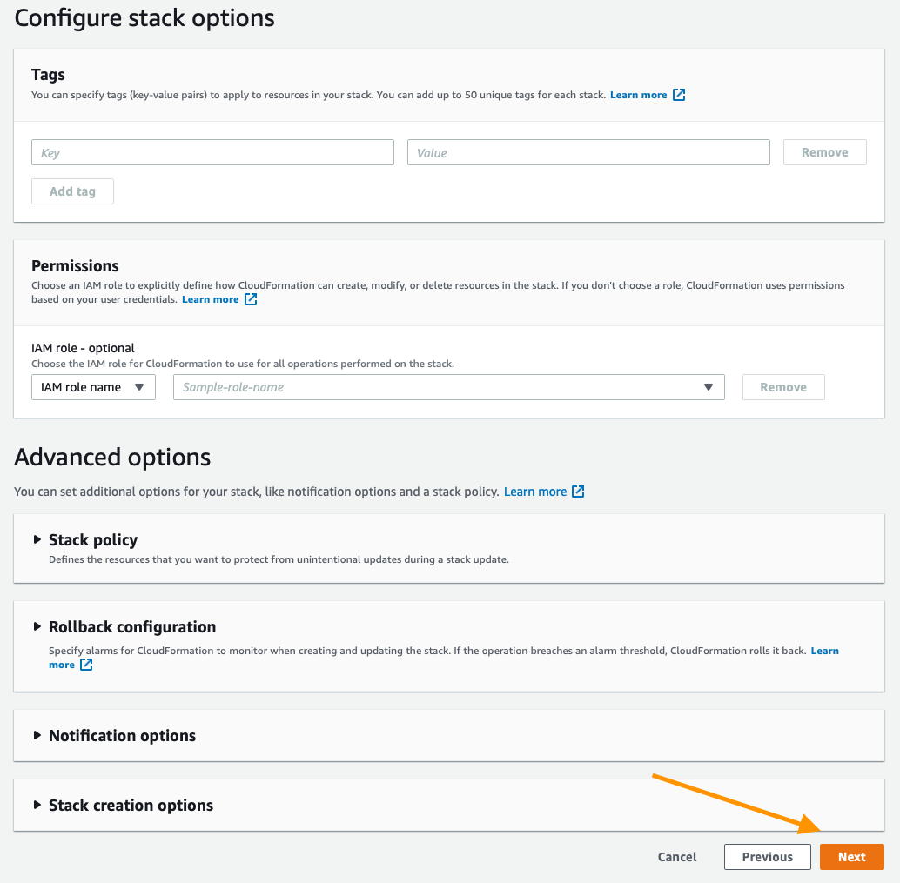
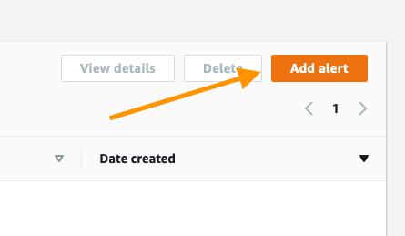

# Human Readable Alerts

By default the alerts that are delivered from Amazon Lookout for Metrics contain a great deal of information via a JSON response, however these are not consumable to the average human, for example:

```JSON
{
  "alertName": "CanaryAlert-009a9443-d34a-41af-b782-f6e409db55c2",
  "alertEventId": "arn:aws:lookoutmetrics:us-east-1:246405784697:Alert:CanaryAlert-009a9443-d34a-41af-b782-f6e409db55c2:event/3bf090ef-5437-4262-920c-512d311c1503",
  "anomalyDetectorArn": "arn:aws:lookoutmetrics:us-east-1:246405784697:AnomalyDetector:CanaryAD-BackTest-PT1H-RCF-LOW_VOL-12768b4f-8636-4089-b",
  "alertArn": "arn:aws:lookoutmetrics:us-east-1:246405784697:Alert:CanaryAlert-009a9443-d34a-41af-b782-f6e409db55c2",
  "alertDescription": null,
  "impactedMetric": {
    "metricName": "revenue",
    "dimensionContribution": [
      {
        "dimensionName": "colorCode",
        "dimensionValueContributions": [
          {
            "dimensionValue": "blue",
            "valueContribution": 100
          }
        ]
      },
      {...

```

The content above is not particularly useful, what we want to do instead is to deploy a simple solution that will deliver a human readable response to our end user so that they can take appropriate action, the guide below will convert the response above into an email that looks like this:

```
An anomaly in revenue was detected on February 17 2021 at 11:00.
1 time series was impacted.

TimeSeries: 1 was impacted on the following dimensions and values:
        colorCode - blue
        deviceType - tablet
        marketplace - CANADA
        platform - windows

The Anomaly  score was: 28.29
To learn more visit the Lookout for Metrics console at: https://us-west-2.con....
```

This provides more digestable information to our user and connects them with the service to learn more.

## Overview

The included CloudFormation template will create the following resources for you:

1. SNS Topic to receive the new alerts.
1. SNS Subscription to deliver the alerts to a specified email address.
1. An IAM Role for Lambda to deliver notifications to ONLY the newly created topic.
1. A Lambda function to actually perform the work

When this compeltes it will look like this:


You will still need to create the Alert mechanism within Lookout for Metrics and to create a role that Lookout for Metrics can assume in order to execute your newly created Lambda. 

The new SNS topic can be used to enable web hooks, sending your messages into third party services, similarly to the continous reference architecture:

Once fully integrated into your existing Lookout for Metrics environment, your architecture will look like this:


Note we have removed webhooks in favor of Email delivery, a more comprehensive solution connecting webhooks is possible and will be available later.


## Getting Started

The simplest possible option is to simply deploy the existing template and answer a few questions, to do that click the link below and follow along with the screenshots provided. At the end of it, the human readable alerts will arrive in your inbox automatically!

[](https://console.aws.amazon.com/cloudformation/home#/stacks/new?stackName=HumanReadableAlerts&templateURL=https://lookoutformetricsbucket.s3.amazonaws.com/HumanReadableAlerts.YAML)

### Cloud Formation Wizard

Start by clicking `Next` at the bottom like shown:


In this screen be sure to update your email address, then click `Next`:


All of the default options here are fine, click `Next`:



This page is a bit longer, so scroll to the bottom, check the box to acknowledge the AWS CloudFormation service will create IAM resourceswith custom names, then click `Next`:


This will take about 2 minutes to complete, you should see a `CREATE_IN_PROGRESS` like this: 


When it is finished you will see:


You have successfully deployed the solution! There are 2 steps remaining:

1. Confirming your subscription to the SNS Topic
1. Integrating this as an Alert in Lookout for Metrics

### Confirming Your Subscription

After creating the Subscription, the SNS service delivers an Email to the address you specified to request confirmation of the Subscription. 

Open your favorite Email client and you should see an email titled: `AWS Notification - Subscription Confirmation`, open it!

Your email should look like this:


Click the `Confirm subscription` link at the bottom. It should open a new page and present you with this notification:


At this point you can now recieve messages to your email address every time a message is posted to that SNS topic, the last step is to integrate this with Lookout for Metrics. **If you have not yet created a detector for anomaly detection, do that first!** If you are just trying out the service, use the Getting Started guide in the `getting_started` folder of this project.

### Creating The Alert

The last thing to do in this process is to create an Alert in Lookout for Metrics, to do that open your AWS Console and visit the Lookout for Metrics page, if you are in `us-west-2` the url is: 
https://us-west-2.console.aws.amazon.com/lookoutmetrics/home?region=us-west-2#

First open the section for your Detector by clicking the drop down triangle on the left:


Now click on the `Alerts` section:


At this point, no Alerts exist, so click the `Add alert` button in the top right to creat your first:



This Wizard is broken down into 2 important sections the `Alert details` and after you make a change to the channel, `Lambda function` information, there is also tagging available but that is up to your discretion.

First fill out the `Alert details` by specifying a name, a description, and the severity threshold. The higher the threshold, the less alerts you will receive, a good starting point is the default of `70`. Then for channel, click the drop down adn select `AWS Lambda`. When completed the top should look like this:


Now move on down to the Lambda function, first click the drop down and select `HumanReadableAlerts` like so:


The next section is for a `Service role` this may have something filled in already, but you want to know that it is configured correctly so click the drop down and select `Create a role`:


The next dialog box will ask for a list of Lambda functions to enable, enter in `HumanReadableAlerts` then click `Create a role`:


You will then see a grean dialog box like the one below, it means that the role was created successfully:


IAM Roles can take a bit to fully propagate, so wait 30 seconds before continuing on. After your wait, scroll to the bottom of the page and click the `Add alert` button:


You will then be redirected to the `Alerts` page where your new alert is listed. Congratulations!!! Your alert is enabled and correctly configured, the next time an anomaly is detected at or above your severity threshold you will receive an email! 

It should look something like this:


That's it! You can continue on below to epxlore more advanced options.


## Extending The Solution

Clicking the `Launch Stack` button above will quickly deploy a working solution for you, but it is not the limits of what can be done, the sections below will highlight how you can customize this approach to better fit your needs.

The logic that transforms the JSON response into plain text can be found in `readable_alerts.py`, when the solution is deployed, the CloudFormation template has a copy of it pasted inside the template for an easy deployment. If you make ANY changes to the python file, simply copy all the content into the YAML file and deploy via your own template not the link provided in the above section. 

There are a couple of sections worth exploring though, the first is pretty simple and provided you are simply sending a text alert, it should suffice for all use cases:

```python
def send_to_sns(message):
    # This takes in a string and simply sends it onto SNS as a message, subject provided for Email clients
    sns = boto3.client("sns")
    sns.publish(TopicArn=topic_arn, 
            Message=message, 
            Subject="Lookout for Metrics Alert Update")
```

You can update the Subject to be more descriptive of course.

The meat of the work is inside this function:

```python
def create_anomaly_string(input_json):
    """
    This function does most of the work, it takes in the entire message of the alert from Lookout for Metrics, then converts it into a readable and actionable message. Steps are commented below, feel free to update as needed.
    """
    # The time is a critical bit of informatin to sort first, this obtains the time and gets it ready for the message
    timestamp = parse(input_json['timestamp'], fuzzy_with_tokens=True)[0]
    timestamp1 = timestamp.strftime("%B %d %Y")
    timestamp2 = timestamp.strftime("%H:%M")
    # Write the first bit about the anomaly, what happened and when.
    response = "An anomaly in " + str(input_json['impactedMetric']['metricName']) + " was detected on " + timestamp1 + ' at ' + timestamp2 + ".\n"
    # Next grab the list of impacted time series
    num_of_time_series = len(input_json['impactedMetric']['relevantTimeSeries'])
    # Report the number of impacted time series to your user
    response += str(num_of_time_series) + " time series was impacted.\n\n"

    # Iterate over each time series, listing the dimensions and their value
    for ts in range(num_of_time_series):
        response += "TimeSeries: " + str(num_of_time_series) + " was impacted on the following dimensions and values:\n"
        for item in input_json['impactedMetric']['relevantTimeSeries'][ts]['dimensions']:
            response += "\t" + item['dimensionName'] + " - " + item['dimensionValue'] + "\n"
            
    # Report the anomaly score
    response += "\nThe Anomaly  score was: " + str(input_json['anomalyScore']) + "\n"
    
    # Generate a link to the console for the user to learn more
    runtime_region = os.environ['AWS_REGION']
    url = "https://" + runtime_region + ".console.aws.amazon.com/lookoutmetrics/home?region=" + runtime_region + "#"
    url += str(input_json['anomalyDetectorArn'])
    url += "/detectorDetails"
    response += "To learn more visit the Lookout for Metrics console at: " + url + " \n"
    return response
```

Comments were provided inline to explain it, but really you can just change this to be whatever you like in order to deliver something more meaningful. 

Inside this directory there is also a file `input.json` it provides a sample JSON response that is delivered to the Lambda for testing. 

Good luck! 