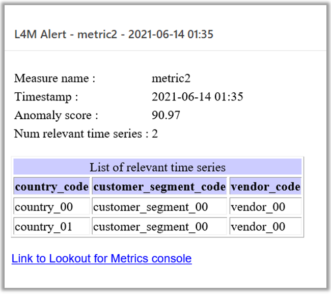
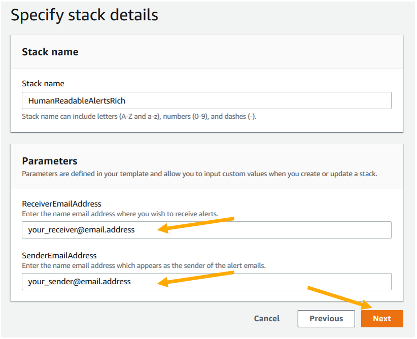
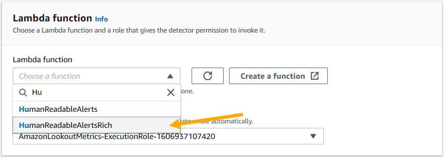
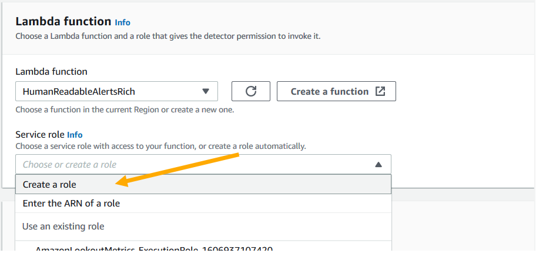
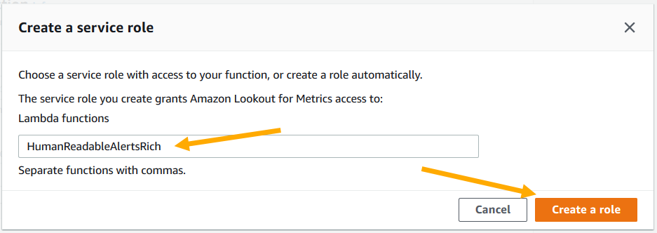
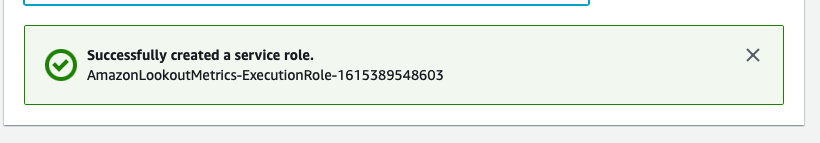
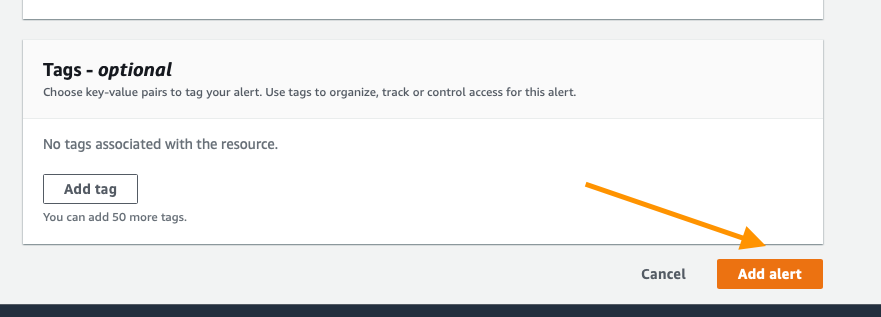

# Human Readable Alerts in HTML email format

The purpose of this sample is to explain how to send HTML formatted emails when anomalies are detected.

## Overview

We use following resources/services in this solution:
* Lambda function - to receive and process Alerts from Lookout for Metrics
* Simple Email Service (SES) - to send HTML emails
* IAM Role - for Lambda to access Lookout for Metrics API and SES API
* Lookout for Metrics Alert - to trigger the Lambda function
* CloudFormation template - to easily set up the Lambda function and IAM Role

The Lambda function receives contents of the alert as Lambda input event. But the alert contains only up to 3 relevant (contributed) time series, and doesn't contain URL to Anomaly detail page on Console.

In order to overcome this limitation, this solution uses Lookout for Metrics API in Lambda function, to look up the Anomaly Group which triggered the alert, and get full details.

## Getting Started

The simplest possible option is to simply deploy the existing template and answer a few questions, to do that click the link below and follow along with the screenshots provided. At the end of it, the human readable alerts will arrive in your inbox automatically!

### Cloud Formation Wizard

Start by clicking `Next` at the bottom like shown:

In this screen be sure to update sender email address and receiver email address, then click `Next`:

All of the default options here are fine, click `Next`:

This page is a bit longer, so scroll to the bottom, check the box to acknowledge the AWS CloudFormation service will create IAM resourceswith custom names, then click `Next`:

This will take about 2 minutes to complete, you should see a `CREATE_IN_PROGRESS` like this: 

When it is finished you will see:

You have successfully deployed the solution! There are 2 steps remaining:

1. Validating sender / receiver email addresses in SES.
1. Integrating the Lambda function as an Alert in Lookout for Metrics

### Validating email addresses in SES

SES requires you to validate email addresses (both sender address and receiver address) you specified. 

Please follow the verification steps reading this document.

[Verifying an email address](https://docs.aws.amazon.com/ses/latest/DeveloperGuide/verify-email-addresses-procedure.html)

### Creating The Alert

The last thing to do in this process is to create an Alert in Lookout for Metrics, to do that open your AWS Console and visit the Lookout for Metrics page, if you are in `us-west-2` the url is: 
https://us-west-2.console.aws.amazon.com/lookoutmetrics/home?region=us-west-2#

First open the section for your Detector by clicking the drop down triangle on the left:

Now click on the `Alerts` section:

At this point, no Alerts exist, so click the `Add alert` button in the top right to creat your first:

This Wizard is broken down into 2 important sections the `Alert details` and after you make a change to the channel, `Lambda function` information, there is also tagging available but that is up to your discretion.

First fill out the `Alert details` by specifying a name, a description, and the severity threshold. The higher the threshold, the less alerts you will receive, a good starting point is the default of `70`. Then for channel, click the drop down adn select `AWS Lambda`. When completed the top should look like this:

Now move on down to the Lambda function, first click the drop down and select `HumanReadableAlerts` like so:

The next section is for a `Service role` this may have something filled in already, but you want to know that it is configured correctly so click the drop down and select `Create a role`:

The next dialog box will ask for a list of Lambda functions to enable, enter in `HumanReadableAlerts` then click `Create a role`:

You will then see a grean dialog box like the one below, it means that the role was created successfully:

IAM Roles can take a bit to fully propagate, so wait 30 seconds before continuing on. After your wait, scroll to the bottom of the page and click the `Add alert` button:

You will then be redirected to the `Alerts` page where your new alert is listed. Congratulations!!! Your alert is enabled and correctly configured, the next time an anomaly is detected at or above your severity threshold you will receive an email! 

It should look something like this:

That's it! You can continue on below to explore more advanced options.

## Extending The Solution

By editing the Lambda function, you can customize the solution, adding different types of information, and changing the design of emails. 

The logic to gather anomaly information and generate HTML formatted email is implemented in the Lambda function (`readable_alerts_rich.py`). The CloudFormation template (`HumanReadableAlertsRich.YAML`) contains a copy of the script, so please note that you may have to update the CloudFormation template if you want to deploy your customized version of the solution using CloudFormation.
