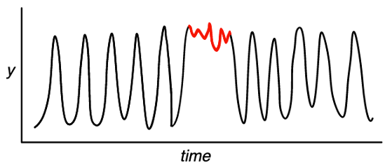

# Welcome to AIM 302: Lookout for Metrics Workshop

**Duration: 120 Minutes**

## What You'll Learn Here:

1. A history of Anomaly Detection at Amazon
1. A working knowledge of the types of problems Amazon Lookout for Metrics can help solve and how to identify or curiate datasets for the service.
1. How to execute a backtesting job with your data to identify the types of anomalies that Amazon Lookout for Metrics can help you find.
1. How to view anomalies and export them for use in other tools.
1. How to create real time anomaly detection workloads and how to iteratively improve your models.
1. How to crawl your datasets with AWS Glue and to build high value datasets for use with Amazon QuickSight.
1. How to import your data and create impactful dashboards with Amazon QuickSight.
1. How to get additional assitance for any Amazon Lookout for Metrics workload or project you may be exploring.

If you're attending this workshop via an official AWS event, there will already be an environment created for you where this content has been deployed, instructions should be provided in the room for accessing this content. Please reach out to any of the presenters or other helping staff if you have questions on how to access this environment.

Otherwise you can deploy this: 

## Agenda:

1. An overview of Anomaly Detection and Amazon Lookout for Metrics
2. A review of how backtesting works 
3. Setting up your own live anomaly detection job ( and why that matters )
4. Building impactful dashboards with Glue and Quicksight.
5. What’s Next?

## Let's Start:

### An Onverview of Anomaly Detection and Amazon Lookout for Metrics:

#### What Do We Mean By Anomaly Detection?

If you've been working in Data Science or Machine Learning you may have read this interesting article: [The AI Hierarchy of Needs](https://hackernoon.com/the-ai-hierarchy-of-needs-18f111fcc007) it contains an interesting graphic: 

In this chart you see a few levels: collect, move/store, explore/transform, aggregate/label, learn/optimize; with collect as the foundation and learn/optimize as the peak. Here you'll notice in explore/transform that Anomaly Detection is listed as one of these components. For the rest of this workshop this is NOT what we mean by Anomaly Detection. In the heirarchy of needs you would be focused on cleansing your dataset to create a performant model based on your collected data. Here we are seeking to build models based on operational data and to simply identify anomalies within that data in order to alert key stakeholders, not specifically to pipeline cleansed data to a new process. Similar use cases, but a little different. 

#### What Is an Anomaly?

**An anomaly is an observation that diverges from otherwise well-structured or patterned data**

Anomalies in time series data can come in a few formats such as:

1. Shifts in expected values: 
1. Breaks in periodicity: 
1. Unclassifiable data points: 

Amazon Lookout for Metrics focuses on: **SHIFTS IN EXPECTED VALUES**. This is key for being successful with the service, you may want to explore more rule based options for breaks or alternative modeling approaches for unclassifiable data points.

### An Overview of Anomaly Detection

At Amazon, Anomaly Detection has been crucial to many key workloads including:

1. Product Analytics - Understanding the performance of millions of products sold on Amazon.com in over 180 countries.
1. Performance of Ads - Monitoring billions of impressions a day on millions of sponsored products. 
1. Customer Experience - Hundreds of millions of customers log onto multiple devices and software versions to visit Amazon.com every month.
1. Database Monitoring - Tracking several hundred million DynamoDB metrics each day over thousands of hosts. 

Monitoring large amounts of data accross businesses with Machine Learning enables Amazon to stay ahead of issues and to constantly deliver a great customer experience. With this expertise many teams at Amazon look to learn best practices and what works from each other, this iteration drives further innovation and occasionally will lead to a new service launch( F O R E S H A D O W I N G).

A rough timeline of Anomaly Detection at Amazon is as follows:

* 1995 - BI and data analytics dashboards were created, then later static rules and thresholds were created to enable rule based alerts.
* 2007 - Building custom machine learning models started
* 2015 - Integration of anomaly detection inside our analytics platforms, usage of deep learning for Anomaly Detection, and creation of Human in the Loop(HITL) algorithms
* 2019 - Grouping and causality algorithms were developed and tested

This experimentation and development gave rise to a few key learnigns on Anomaly Detection:

Namely, Machine Learning based techniques perform well, but need to solve multiple complex problems in order to be useful.

Furthermore:

* Customer data is unique and one single anomaly detection algorithm or approach will not fit all data types
* Generating actionable results by learning relationships across customer metrics is critical to faster remediation
* Being able to dynamically adapt to changing business cycles and seasonal trends helps reduce false alerts, resulting in improved accuracy
* Building accurate and effective anomaly detection requires ML experts

All of those points are what helped navigate our development as we built and launched Amazon Lookout for Metrics. 

### An Overview of Amazon Lookout for Metrics

Amazon Lookout for Metrics Amazon Lookout for Metrics is a new service that detects outliers in your time-series data, determines their root causes, and enables you to quickly take action. Built from the same technology used by Amazon.com, Amazon Lookout for Metrics reflects 20 years of expertise in outlier detection and machine learning.

With Amazon Lookout for Metrics, you can build highly-accurate, machine learning models (called Detectors) to find outliers in your data, without any machine learning expertise. Amazon Lookout for Metrics detects outliers on live or real-time data. If you have historical data, Amazon Lookout for Metrics will use it to train a model which will then detect outliers on live data. If you do not have historical data then Amazon Lookout for Metrics will train a model on-the-go. Using the Amazon Lookout for Metrics console or SDK, you simply provide Amazon Lookout for Metrics with the location and scope of your data. This includes the Measures, which are the variables that you want to investigate (like revenue), and dimensions, which are the categorical variables that correspond to a measure (revenue can have dimensions such region and product category). Amazon Lookout for Metrics then automatically chooses the best machine learning algorithm to optimize performance for your outlier detection use case and begins training a detector. Amazon Lookout for Metrics uses this custom-trained detector to monitor your chosen metrics for outliers, allowing you to quickly identify and resolve issues that are likely to impact your business. Amazon Lookout for Metrics can also integrate with Amazon SNS to alert you when the service detects important outliers.

By using Amazon Lookout for Metrics you have a lot of options at your disposal to ingest data into the service for Anomaly Detection. We support native AWS Integrations with:

* Amazon S3
* Amazon CloudWatch
* Amazon Redshift
* All RDS Databases
* All Aurora Databases

In addition to those, you can use Amazon AppFlow to integrate with third-party services like:

* Salesforce
* Marketo
* Google Analytics
* [And More!](https://docs.aws.amazon.com/appflow/latest/userguide/lookout.html)

Once you have connected your datasource to Amazon Lookout for Metrics the service can either execute a backtesting job(looks for anomalies in your historical data) or a continuous detector(looks for new anomalies periodically in the future). After the serivce has identified an anomaly, your users can visit the console to learn more iformation about the event or you can leverage Amazon SNS and AWS Lambda to modify the notifications being sent to your users. This will allow you to support adding additional narrative content to your anomalies and even business context as well as the ability to inject them into your existing business processes or toools like Slack or DataDog.

There are really 3 steps to getting started with Amazon Lookout for Metrics:

1. Create a Detector - A detector is a machine learning model for anomaly detection with the service, and an isolated environment. Changes to one detector cannot impact any others.
1. Define Metrics - Metrics are calculated based on the measures and dimensions in your data source. You designate a data source and select measures and dimensions to monitor.
1. Activate the Detector - When you’re ready, activate the detector to begin data analysis, this kicks off the training process for both continous and backtesting modes. You can view the detector’s progress in real time via the console or API.

### A Review of How Backtesting Works

This lab begins with this entire process already completed for you!(Side note: If you are running this on your own, outside of an AWS event, this process could still be running, it takes from 1-2 hours to complete from deploying the initial template so be patient!)

Our lab events are often capped at 2 hours and we wanted to make sure you get to explore all the options of Amazon Lookout for Metrics within that time frame, so some work needed to be done beforehand. 

What has already been completed:

1. A CloudFormation template was deployed which kicks off this entire process, starting with a new S3 bucket to hold Lambda functions, next IAM roles for SageMaker, and a SageMaker Notebook instance.
1. The SageMaker Notebook will deploy a collection of Step Functions and create a new bucket for your historical and future data, it also loads that data into the bucket for you. 
1. The step functions create a detector, attach your dataset to it, kick off a backtesting job, and connect a last Lambda to an alert that will stream all identified anomalies into S3 for later examination.

There is still plenty to be done, and before you go any further, let's dive into some basics. From there, you will visit the console to review some of the results before moving onto Live Detection and scaling beyond just using Amazon Lookout for Metrics.

### An Overview of A Dataset:

In this lab you were provided a sample dataset containing some historical as well as future looking data, in the real world it would not be possible to generate future looking data but it was done here for educational purposes. You'll definitely want to create some form of data pipeline to reliably grab data from your systems of record and stream it into Amazon S3 if this is the storage engine you choose. 

*Note* Earlier we showed various connectors like RDS, Redshift and more. Each of those requires you to create a table with your information correctly formatted to work with Amazon Lookout for Metrics. Often it is easier to export to Amazon S3 to begin your ETL process, then feed the data into Amazon Lookout for Metrics. *End Note*

Amazon Lookout for Metrics works on structured time series datasets, if your dataset is not in that format you'll want to start with an ETL process to reformat it first. Below you can see a simple dataset:

In the image above, you can see that a `record` is an entire row in this structured dataset. A `field` is simply a given entry in any particular row. You can structure your data for Amazon S3 using CSV or JSONLines files, for simplicity in rendering a preview and a table in markdown, we are using CSVs.

In the above image you can now see a few of the key concepts for Amazon Lookout for Metrics. In particular: `measure` and `dimensions`. As well as a required `timestamp` field. Here a `measure` is a singular numerical column which will be checked and aggregated when looking for anomalies later. The aggregation and identification of a specific `measure` is done by the unique intersection of `dimensions`. A `dimension` is a categorical field in your data. In the above case group 1 at us-east-1 has a CPU utilization of 16 at the particular timestamp, this would constitute one `metric`. A `metric` is defined as a particular `measure` and its relevant unique intersection of `dimensions`. 

### Backtesting: The feature that can test your assumptions

One of the most powerful features in Amazon Lookout for Metrics is backtesting. With it and a little bit of time and a dataset you can quickly identify anomalies in your data and understand what kind of anomalies can be detected and the impacts that can have for your use case.  

In the image above we break down the ways you can feed data into Amazon Lookout for Metrics and the types of data you can provide:

1. Only historical data - backtesting where it learns on the oldest 70% of your data and evaluates for anomalies in the most recent 30%.
1. Historical and continous data - Here you can build a model using exclusively the historical data and start with a model that has seen variations in your time series over some history.
1. Continous data only - This would be cold starting, the service will recieve data until enough has been ingested for it to build a model and start executing anomaly detection.

To understand how much data is required for the cold starting process take a look at the chart below:

For a more detailed breakdown of the requirements check out: https://docs.aws.amazon.com/lookoutmetrics/latest/dev/quotas.html

To see how to setup a backtesting job on your own later, check out: https://github.com/aws-samples/amazon-lookout-for-metrics-samples/blob/main/getting_started/BacktestingWithTheConsole.md

### Getting Started with The Lab:

### Setting Up Your Own Live Anomaly Detector

### Building Impactful Dashboards with Glue and Quicksight

### What’s Next

## Todos
- Port get anomalies script to lambda
- Port lambda to CF template
- Combine ec2 bootstrapping with lambda CF
- Validate EE support
- Document how to create dashboards
- Validate EE Support of dashboards
- Cut screenshots and document
- Port PPTX content into docs as well.
- LOTS OF DRY RUNS