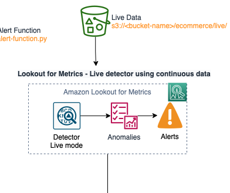
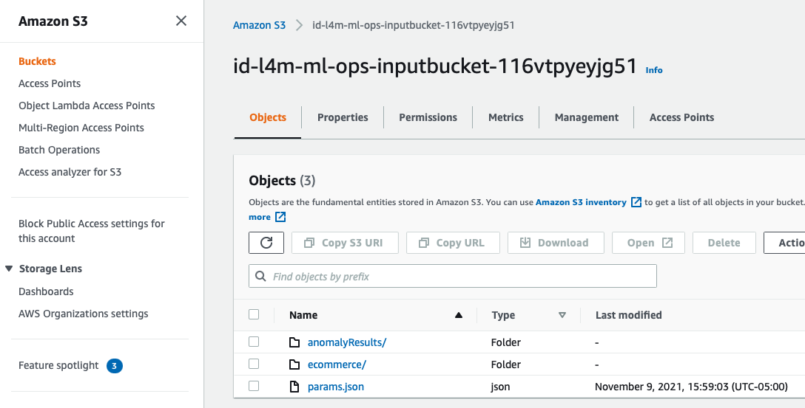
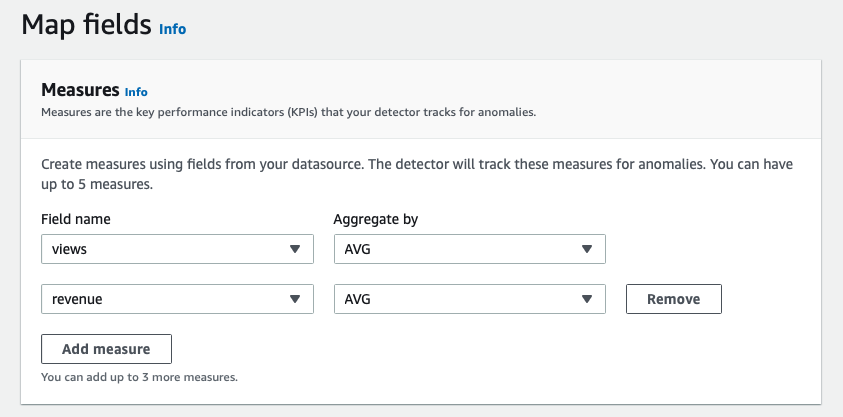
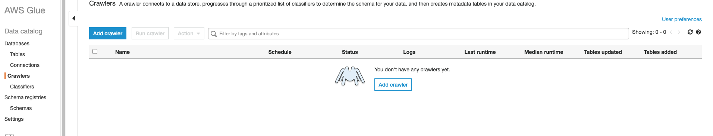
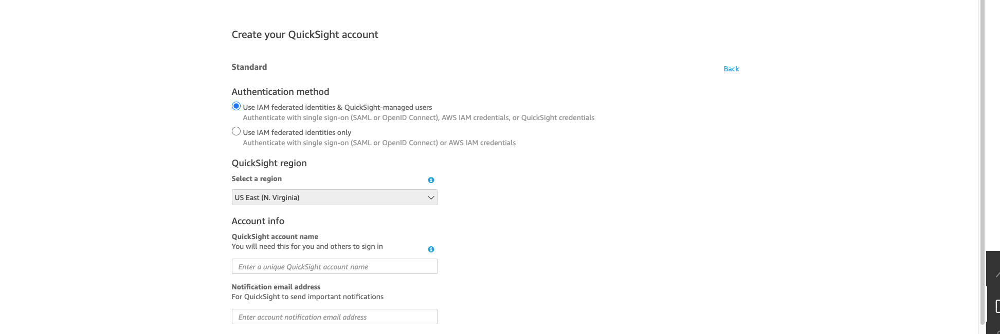
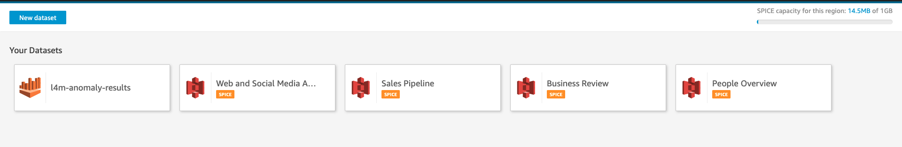
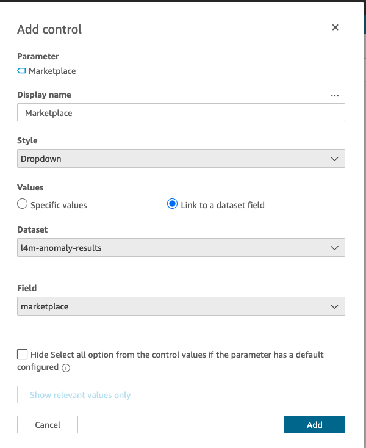

# Welcome to AIM 302: Lookout for Metrics Workshop

**Duration: 120 Minutes**


## What You'll Learn Here:

1. A history of Anomaly Detection at Amazon
1. A working knowledge of the types of problems Amazon Lookout for Metrics can help solve and how to identify or curate datasets for the service.
1. How to execute a backtesting job with your data to identify the types of anomalies that Amazon Lookout for Metrics can help you find.
1. How to view anomalies and export them for use in other tools.
1. How to create real time anomaly detection workloads and how to iteratively improve your models.
1. How to crawl your datasets with AWS Glue and to build high value datasets for use with Amazon QuickSight.
1. How to import your data and create impactful dashboards with Amazon QuickSight.
1. How to get additional assitance for any Amazon Lookout for Metrics workload or project you may be exploring.


If you're attending this workshop via an official AWS event, there will already be an environment created for you where this content has been deployed, instructions should be provided in the room for accessing this content. Please reach out to any of the presenters or other helping staff if you have questions on how to access this environment.

Otherwise you can deploy this: [](https://console.aws.amazon.com/cloudformation/home#/stacks/new?stackName=ALFMWorkshopRI2021&templateURL=https://lookoutformetricsbucket.s3.amazonaws.com/AL4MWorkshop.yaml)


## Architecture Diagram

During this workshop you'll cover everything below! Don't worry if it looks a bit overwhelming, you'll be taking each section bit by bit until they are all deployed and it makes sense.


## Agenda:

1. An overview of Anomaly Detection and Amazon Lookout for Metrics
2. A review of how backtesting works 
3. Setting up your own live anomaly detection job ( and why that matters )
4. Building impactful dashboards with Glue and Quicksight.
5. What’s Next?


## Let's Start:

### An Onverview of Anomaly Detection and Amazon Lookout for Metrics:

#### What Do We Mean By Anomaly Detection?

If you've been working in Data Science or Machine Learning you may have read this interesting article: [The AI Hierarchy of Needs](https://hackernoon.com/the-ai-hierarchy-of-needs-18f111fcc007) it contains an interesting graphic: 


In this chart you see a few levels: collect, move/store, explore/transform, aggregate/label, learn/optimize; with collect as the foundation and learn/optimize as the peak. Here you'll notice in explore/transform that Anomaly Detection is listed as one of these components. For the rest of this workshop this is NOT what we mean by Anomaly Detection. In the heirarchy of needs you would be focused on cleansing your dataset to create a performant model based on your collected data. Here we are seeking to build models based on operational data and to simply identify anomalies within that data in order to alert key stakeholders, not specifically to pipeline cleansed data to a new process. Similar use cases, but a little different. 

#### What Is an Anomaly?


**An anomaly is an observation that diverges from otherwise well-structured or patterned data**

Anomalies in time series data can come in a few formats such as:

1. Shifts in expected values: 
1. Breaks in periodicity: 
1. Unclassifiable data points: 

Amazon Lookout for Metrics focuses on: **SHIFTS IN EXPECTED VALUES**. This is key for being successful with the service, you may want to explore more rule based options for breaks or alternative modeling approaches for unclassifiable data points.


### An Overview of Anomaly Detection


At Amazon, Anomaly Detection has been crucial to many key workloads including:

1. Product Analytics - Understanding the performance of millions of products sold on Amazon.com in over 180 countries.
1. Performance of Ads - Monitoring billions of impressions a day on millions of sponsored products. 
1. Customer Experience - Hundreds of millions of customers log onto multiple devices and software versions to visit Amazon.com every month.
1. Database Monitoring - Tracking several hundred million DynamoDB metrics each day over thousands of hosts. 

Monitoring large amounts of data accross businesses with Machine Learning enables Amazon to stay ahead of issues and to constantly deliver a great customer experience. With this expertise many teams at Amazon look to learn best practices and what works from each other, this iteration drives further innovation and occasionally will lead to a new service launch( F O R E S H A D O W I N G).

A rough timeline of Anomaly Detection at Amazon is as follows:

* 1995 - BI and data analytics dashboards were created, then later static rules and scores were created to enable rule based alerts.
* 2007 - Building custom machine learning models started
* 2015 - Integration of anomaly detection inside our analytics platforms, usage of deep learning for Anomaly Detection, and creation of Human in the Loop(HITL) algorithms
* 2019 - Grouping and causality algorithms were developed and tested

This experimentation and development over Amazon's history gave rise to a few key learnigns on Anomaly Detection:


Namely, Machine Learning based techniques perform well, but need to solve multiple complex problems in order to be useful.

Furthermore:

* Customer data is unique and one single anomaly detection algorithm or approach will not fit all data types
* Generating actionable results by learning relationships across customer metrics is critical to faster remediation
* Being able to dynamically adapt to changing business cycles and seasonal trends helps reduce false alerts, resulting in improved accuracy
* Building accurate and effective anomaly detection requires ML experts

All of those points are what helped navigate our development as we built and launched Amazon Lookout for Metrics. 


### An Overview of Amazon Lookout for Metrics

Amazon Lookout for Metrics Amazon Lookout for Metrics is a new service that detects outliers in your time-series data, determines their root causes, and enables you to quickly take action. Built from the same technology used by Amazon.com, Amazon Lookout for Metrics reflects 20 years of expertise in outlier detection and machine learning.

With Amazon Lookout for Metrics, you can build highly-accurate, machine learning models (called Detectors) to find outliers in your data, without any machine learning expertise. Amazon Lookout for Metrics detects outliers on live or real-time data. If you have historical data, Amazon Lookout for Metrics will use it to train a model which will then detect outliers on live data. If you do not have historical data then Amazon Lookout for Metrics will train a model on-the-go. Using the Amazon Lookout for Metrics console or SDK, you simply provide Amazon Lookout for Metrics with the location and scope of your data. This includes the Measures, which are the variables that you want to investigate (like revenue), and dimensions, which are the categorical variables that correspond to a measure (revenue can have dimensions such region and product category). Amazon Lookout for Metrics then automatically chooses the best machine learning algorithm to optimize performance for your outlier detection use case and begins training a detector. Amazon Lookout for Metrics uses this custom-trained detector to monitor your chosen metrics for outliers, allowing you to quickly identify and resolve issues that are likely to impact your business. Amazon Lookout for Metrics can also integrate with Amazon SNS to alert you when the service detects important outliers.


By using Amazon Lookout for Metrics you have a lot of options at your disposal to ingest data into the service for Anomaly Detection. We support native AWS Integrations with:

* Amazon S3
* Amazon CloudWatch
* Amazon Redshift
* All RDS Databases
* All Aurora Databases

In addition to those, you can use Amazon AppFlow to integrate with third-party services like:

* Salesforce
* Marketo
* Google Analytics
* [And More!](https://docs.aws.amazon.com/appflow/latest/userguide/lookout.html)

Once you have connected your datasource to Amazon Lookout for Metrics the service can either execute a backtesting job(looks for anomalies in your historical data) or a continuous detector(looks for new anomalies periodically in the future). After the serivce has identified an anomaly, your users can visit the console to learn more iformation about the event or you can leverage Amazon SNS and AWS Lambda to modify the notifications being sent to your users. This will allow you to support adding additional narrative content to your anomalies and even business context as well as the ability to inject them into your existing business processes or toools like Slack or DataDog.

There are really 3 steps to getting started with Amazon Lookout for Metrics:

1. Create a Detector - A detector is a machine learning model for anomaly detection with the service, and an isolated environment. Changes to one detector cannot impact any others.
1. Define Metrics - Metrics are calculated based on the measures and dimensions in your data source. You designate a data source and select measures and dimensions to monitor.
1. Activate the Detector - When you’re ready, activate the detector to begin data analysis, this kicks off the training process for both continous and backtesting modes. You can view the detector’s progress in real time via the console or API.


### A Review of How Backtesting Works

This lab begins with this entire process already completed for you!(Side note: If you are running this on your own, outside of an AWS event, this process could still be running, it takes from 1-2 hours to complete from deploying the initial template so be patient!)

Our lab events are often capped at 2 hours and we wanted to make sure you get to explore all the options of Amazon Lookout for Metrics within that time frame, so some work needed to be done beforehand. 

What has already been completed:

1. A CloudFormation template was deployed which kicks off this entire process, starting with a new S3 bucket to hold Lambda functions, next IAM roles for SageMaker, and a SageMaker Notebook instance.
1. The SageMaker Notebook will deploy a collection of Step Functions and create a new bucket for your historical and future data, it also loads that data into the bucket for you. 
1. The step functions create a detector, attach your dataset to it, kick off a backtesting job, and connect a last Lambda to an alert that will stream all identified anomalies into S3 for later examination.

**NOTE**: The templates above are designed to be reusable and can be ported to any custom dataset you have, simply adjust the params.json file to be relevant to your dataset and you have an instant end-to-end pipeline that will setup your workload and execute a backtesting job. This could also be easily modified to support continous live detection of anomalies as well!**END NOTE**


There is still plenty to be done, and before you go any further, let's dive into some basics. From there, you will visit the console to review some of the results before moving onto Live Detection and scaling beyond just using Amazon Lookout for Metrics.

### An Overview of A Dataset:

In this lab you were provided a sample dataset containing some historical as well as future looking data, in the real world it would not be possible to generate future looking data but it was done here for educational purposes. You'll definitely want to create some form of data pipeline to reliably grab data from your systems of record and stream it into Amazon S3 if this is the storage engine you choose. 

**NOTE** Earlier we showed various connectors like RDS, Redshift and more. Each of those requires you to create a table with your information correctly formatted to work with Amazon Lookout for Metrics. Often it is easier to export to Amazon S3 to begin your ETL process, then feed the data into Amazon Lookout for Metrics. **END NOTE**

Amazon Lookout for Metrics works on structured time series datasets, if your dataset is not in that format you'll want to start with an ETL process to reformat it first. Below you can see a simple dataset:


In the image above, you can see that a `record` is an entire row in this structured dataset. A `field` is simply a given entry in any particular row. You can structure your data for Amazon S3 using CSV or JSONLines files, for simplicity in rendering a preview and a table in markdown, we are using CSVs.


In the above image you can now see a few of the key concepts for Amazon Lookout for Metrics. In particular: `measure` and `dimensions`. As well as a required `timestamp` field. Here a `measure` is a singular numerical column which will be checked and aggregated when looking for anomalies later. The aggregation and identification of a specific `measure` is done by the unique intersection of `dimensions`. A `dimension` is a categorical field in your data. In the above case group 1 at us-east-1 has a CPU utilization of 16 at the particular timestamp, this would constitute one `metric`. A `metric` is defined as a particular `measure` and its relevant unique intersection of `dimensions`. 


### Backtesting: The feature that can test your assumptions

One of the most powerful features in Amazon Lookout for Metrics is backtesting. With it and a little bit of time and a dataset you can quickly identify anomalies in your data and understand what kind of anomalies can be detected and the impacts that can have for your use case.  


In the image above we break down the ways you can feed data into Amazon Lookout for Metrics and the types of data you can provide:

1. Only historical data - backtesting where it learns on the oldest 70% of your data and evaluates for anomalies in the most recent 30%.
1. Historical and continous data - Here you can build a model using exclusively the historical data and start with a model that has seen variations in your time series over some history.
1. Continous data only - This would be cold starting, the service will recieve data until enough has been ingested for it to build a model and start executing anomaly detection.


To understand how much data is required for the cold starting process take a look at the chart below:


For a more detailed breakdown of the requirements check out: https://docs.aws.amazon.com/lookoutmetrics/latest/dev/quotas.html

To see how to setup a backtesting job on your own later, check out: https://github.com/aws-samples/amazon-lookout-for-metrics-samples/blob/main/getting_started/BacktestingWithTheConsole.md


### Getting Started with The Lab:

First up, reviewing a fully executed backtesting workload, from the architecture diagram earlier we'll be focusing on this subset:


#### Detectors and Datasets:

Finally! The time has come to start using Amazon Lookout for Metrics, to begin login to your temporary AWS account or the account in which you deployed this workshop. If you are asked for a one time token, that's fine just put in any email address you have access to and you'll get a token to enter in your browser so that you can continue along.

Once you have logged into the console, start by entering `Lookout for Metrics` in your search bar at the top and clicking on the service like so:


This will take you to the service page below:


Here you can see the arrow is poitning at an expand icon, click it, then click `Detectors` to see a full list of detectors that have been deployed in your account. Remember a Detector is a trained model for anomaly detection and note that one has been created for you already. If you do not see a detector yet, take a look in the top right corner of the screen and ensure that you are in `N. Virginia` or `us-east-1` for a region. **Note** your instructor may indicate a different region for your specific workshop.

Continue on by clicking on the `lookout-for-metrics-workshop-backtesting-detector` detector, note that the backtesting job has completed, when you run your own experiements that field will update to let you know how the job is progressing, it can also be polled via an API.


Once you havce clicked on the detector you'll be taken to a full view of the detector:


There are some really interesting bits of information here. First you can see the updates that everything was created, a dataset was added, the backtest job was complete, and 1 alert was added, all of these are in grean near the top. Also at the bottom you'll see a collection of date ranges that showcase the exact time periods for your anomaly detection job, such as the dates that were used for training and the specific date ranges where anomalies could have been detected. Use this information later on your own datasets to confirm a known anomlay was inside the detection period if you're looking to see how Amazon Lookout for Metrics would respond to a specific event.

In the middle of this page you'll also see that the detection interval was for `1 hour intervals`, this means that the service will be aggregating data as appropriate and then looking for anomalies every hour in the date ranges reported. 

Next, take a look at the specific dataset that was provided, you can do that by clicking on the `Dataset` link in the left panel:


Again there's a ton of content to absob on this page, you can see the interval is once again hourly and the location of your dataset, this will be come relevant again in the next section when it is time to create a continuous detector.

Take a look at the bottom:


This is where you can see the various components of our dataset, specifically that `views` and `revenue` were listed as measures, meaning they are numerical columns and those values will be checked for anomalous entries, also their aggregation function is `SUM` meaning that if more data points are provided for this value within a given time frame, they will be added together before anomaly detection occurs. Also the dimensions are `platform` and `marketplace` , the categorial entries here are what identify specific entries for the measures of `view` and `revenue`. Lastly, the timestamp column is `timestamp` and you can see that we parse the data using `yyyy-MM-dd HH:mm:ss` as the format.


#### Viewing Anomalies 

To view the anomalies detected via the backtest job, start by clicking the `Anomalies` link on the left, as shown below. It is worth nothing this link will also behave the same way for a continous detector as well.


At long last! Anomalies!!!!


The `Severity score` slider can be shifted to a higher value(to see more severe and also less total anomalies) or a lower value(more anomalies will be shown). The `severity score` of an anomaly is a function of how far the observed value was from what was expected, and over how many metrics it impacts. For example a 10% drop in sales for 100 stores might be shown as more severe than a 15% drop in sales for a specific store. This slider can be helpful when deciding what value you would like to select for `Alerts`, if you are exporting them as we are in this lab for visualization elsewhere then `1` makes sense as a value(the lowest). However, if you are sending these alerts to users for further investigation you will want to select a higher value to help reduce the likelihood of alert fatigue for your end users.

To view an anomaly, click any of the title's in the Anomalies list on the under the severity score slider, any will do, it will take you to a details page on that anomaly.


On this page you can see the time the anomaly was detected, the domains over which it occured(Marketplace: ES and Platform Pc_web) as well as the historical data points and the higlighted(last) anomalous data point! If multiple other dimensions showcase a similar anonmaly at the time, they will be grouped together and you can see them individually with their own rendered graphs below. There you can also specify in the right corner of each graph, `Is this relevant? Yes or No`, this feature creates a labeled data point for this anomaly, as the service retrains this data is used to build a model that reduces false positives and generates anomalies that you are looking to act upon, or that you find relevant. 

Sometimes you may find that you want to share this information with others, that takes you to the next section, Alerts.

#### Alerts

The final component to Lookout for Metrics is `Alerts`, they allow you to specify a specific severity score and to deliver a JSON response to either AWS Lambda or Amazon SNS. To view a sample of this JSON payload, take a look [here](https://github.com/aws-samples/amazon-lookout-for-metrics-samples/blob/main/next_steps/readable_alerts/input.json), alterantively you could make an API call and examine one of your very own!

To see how we've configured alerts so far, click on `Alerts` on the left sidebar:


Once the page loads you should see a simlpe alert function named `alertexporter` deployed:


Clicking on the name will bring up more details about the alert, you can already see the severity score of `1` and that the delivery channel defined was `Lambda`. The severity score was selected so that all anomalies that are detected are reacted to, this allows us to use this function to stream our anomalies to S3. Later in this workshop you will see how to fetch that data and how to visualize it with your own custom dashboards in Amazon QuickSight.

Having thoroughly reviewed a completed backtesting detector, the next step is to create your own continuous one!

### Setting Up Your Own Live Anomaly Detector

From here you'll now focus on the bits of the architecture diagram on the right side, more specifically:




#### Creating a Detector and Connecting a Dataset

The next step in your journey is one you have probaby taken countless times, opening a new browser tab! After that enter `https://console.aws.amazon.com` as the URL and once again navigate to the `Lookout for Metrics` service page. This will allow you to have one tab open with your old detector, and one open for the process of creating a new one(many values can be carried over).

Once you are at the `Lookout for Metrics` service console page, click the orange `Create detector` button on the right:


This should take you to a long form that looks like this:


The first thing to enter is a detector name, there are some checks in the console to prevent a name that will not work, but to keep things simple use: `l4m-workshop-continous-detector`(1). A description is totally optional. For interval, click the drop down and select `1 hour intervals`(2), to continue to the next page click `Create`(3).


With that completed, the console will prompt you to enter the next step, adding a dataset. This is done by clicking the orange `Add a dataset` button in the console:


After clicking, you'll be taken to the page for chosing chosing a datasource, this has a number of options including connectors to RDS databases and external sources like SalesForce but for this workshop you'll be using S3. This is a wonderful option if you find yourself needing to do custom ETL work to build a dataset for Lookout for Metrics. 

Start by entering:

1. A name - go with `l4m-workshop-continuous-dataset`
1. An optional description
1. Selecting `UTC+0` for your time zone.

This portion should look like this:


The next component of this form is the `Datasetsource details` section, this is where you specify to use S3. Do so by clicking it from the dropdown, then click the `Continuous` mode button. You will then be prompted for an object in your continuous dataset. When using Amazon Lookout for Metrics, you need to structure the data in S3 in such a way that the service knows where to be able to find it when it is time to look for anomalies. To accomplish this we use folder pathing that contain timestamps to guide the services' crawlers for your data. That being said, it can be cumbersome to type out date parsing logic on your own so the console contains a helper function that can look at an example file and attempt to guess the time format you are using. 

In this workshop the data has already been provided, to get a sample file open a new browser tab or window to: `https://console.aws.amazon.com` and then search for `S3` and open the corresponding console page.


Your bucket has been programatically generated so to find it, search for `input` in the `Find buckets by name field`:


Click on the bucket name to open it, inside you should see 3 items like this:




From here we want to get a sample of some of our `live` data, to do this open the `ecommerce` folder, then the `live` folder, pick any random date after that for your next folder, then select `1300` for your next folder, click the name of the CSV file, and you should see a screen like the one below, on this page, click the `Copy S3 URI` button in the top center:


You did all of this to obtain a sample input file that contains time series data. To take a look at the sample data you can download the file via the button to the left of the one you just clicked. When you open the text file you should see something like this in the contents:

```csv
platform,marketplace,timestamp,views,revenue
pc_web,us,2021-01-24 11:00:00,553,165.9
pc_web,uk,2021-01-24 11:00:00,528,158.4
pc_web,de,2021-01-24 11:00:00,800,240.0
pc_web,fr,2021-01-24 11:00:00,593,177.9
pc_web,es,2021-01-24 11:00:00,237,71.1
pc_web,it,2021-01-24 11:00:00,344,103.2
pc_web,jp,2021-01-24 11:00:00,468,140.4
mobile_web,us,2021-01-24 11:00:00,496,148.79999999999998
mobile_web,uk,2021-01-24 11:00:00,708,212.4
mobile_web,de,2021-01-24 11:00:00,517,155.1
mobile_web,fr,2021-01-24 11:00:00,430,129.0
mobile_web,es,2021-01-24 11:00:00,552,165.6
mobile_web,it,2021-01-24 11:00:00,466,139.79999999999998
mobile_web,jp,2021-01-24 11:00:00,277,83.1
mobile_app,us,2021-01-24 11:00:00,260,78.0
mobile_app,uk,2021-01-24 11:00:00,270,81.0
mobile_app,de,2021-01-24 11:00:00,754,226.2
mobile_app,fr,2021-01-24 11:00:00,349,104.7
mobile_app,es,2021-01-24 11:00:00,430,129.0
mobile_app,it,2021-01-24 11:00:00,176,52.8
mobile_app,jp,2021-01-24 11:00:00,272,81.6
```

These are the records for 1 hour of data for our particular dataset, armed now with the URI in your clipboard, go back to the Amazon Lookout for Metrics console page and paste it into the field `Path to an object in your continuous dataset`, then click the `Continuous data S3 path pattern` drop down for a list of options, select the one most similar to the screenshot below. You are looking to see the bucket name as well as `{{yyyyMMdd}}/{{HHmm}}/`


For the `Datasource interval` select `1 hour intervals` from the drop down. The next parameter is `Offset in seconds`, given that our data is precomputed in this workshop this parameter has no use. In the real world however you may need to wait on data to arrive before looking for anomalies, determine how long that process will take and specify the correct value of seconds there.


You also have the option of using historical data, if you'd like you can select that option, then go back to the console and find the backtest csv inside the S3 bucket under `ecommerce`. By default, just ignore it and continue on. If you provide historical data, the detector will learn from your history before attempting to execute anomaly detection, this generally builds a more performant initial model.

Under the section of `Format` all of the default values are fine and can be ignored, however do take a look at them to see what your options are for your own datasets.

The last required parameter to specify to Amazon Lookout for Metrics to access and parse your dataset is the `Service role` this is created so that Amazon Lookout for Metrics has access to your content. A role was already created for you when the backtesting job was created so we will go back and reuse it. Start by opening your original Amazon Lookout for Metrics browser tab, then clicking `Dataset` on the left, and then click the square icons near `IAM role` in the details that load, this will copy the role's ARN for you.


With that copied, navigate back to the form you were working on and click the `Service role` drop down, then select `Enter the ARN of a role`:


In the form field below, paste the IAM role ARN you copied, then click `Next` to move on to mapping your fields.


Amazon Lookout for Metrics will try to validate that the role provided and the S3 URIs provided work for providing data to the service, if this is successful you'll see a `Validation complete` notification like the one below, just click `OK` to continue on.


Earlier you saw a preview of the data that looked like the image below:

```csv
platform,marketplace,timestamp,views,revenue
pc_web,us,2021-01-24 11:00:00,553,165.9
```

Here you see numerical values or measures for views and revenue, as well as string or dimensional values for platform and marketplace(dimensions can also be numerical but they are treated as a string). Also the timestamp field is there, looking like a timestamp.

Start on this page by specifying the fields athat are measures, and then a corresponding aggregation function. Given the data is hourly and we are not aggregating into days, this has no impact on our results, so feel free to choose `AVG`(Average) or `SUM`.

Complete your inputs to look like the image below, click `Add measure` once to add the additional field:



Dimensions are optional but are incredibly useful for letting your users and Amazon Lookout for Metrics know where an anomaly came from in a human readable way, also without the categorial fields, the service would add up all the numerical ones and just track them as one large aggregate. For this dataset click the `Add dimension` button twice and click the drop down selecting `platform` and `marketplace` as your dimensions:


For your `Timestamp` field click the drop down and select `timestamp` as the field, then click the `Enter a tiemstamp format` radio button, followed by pasting in this:`yyyy-MM-dd HH:mm:ss`. That configures your dataset and you are ready to click `Next`.


The following page is just a review of everything that you configured, it should look like this:


Click the `Save and activate` button in the bottom right, then enter `confirm` in the dialog that this will incur costs and click `Activate`. This workshop configuration is within the Free tier for all services used, and if you are in an official AWS event there is no cost associated with running this. However, your organizations usage may impact this if you are deploying it within your own AWS account or a corporate one, so check with any IT administrators to understand any potential impacts if you need to.

Once you have clicked `Activate` you will be taken back to the overview page for your detector. The model is training and will be ready within an hour or so. To learn the final bit of setting up a workload with Amazon Lookout for Metrics click `Add alerts` to add an alert function.

#### Adding Alerts

In the backtesting job that was deployed beforehand, an alert funciton was deployed that will take an anomaly and record it into S3 so that it can be viewed and examined in other tools. In this case you are now going to add that same alert function to your continuous detector. After clicking the `Add alerts` function you'll be taken to a wizard to guide you through that process.

Enter a sample name(`alert-exporter-continuous`), description, set your severity threshold to `1` instead of `70`(this ensures all anomalies are delivered to your bucket, 70 may make sense in a real case of delivering alerts to 3rd party services though), and click the dropdown for `Channel` and select `AWS Lambda`:


For AWS Lambda you will need to choose a specific function, do this by going back to your backtesting detector's tab and clicking `Alerts` on the left side, then the alert's name:


On this page there are 2 values to copy the `Lambda function` and `Service role ARN`(has a square for copying it):


Copy the `Lambda function` value first and then enter it in your new alert's form, then copy the `Service role ARN` and enter it under `Custom service role ARN` as show below:


Then click `Add alert`, that was it! From here on out, all anomalies caught by your new detector will have their content written to S3. This could have been configured to stream data to a ticketing system or to create a readable email alert, once you are processing the data via Lambda you can really get creative.

For this exercise though the next thing to do is start to build more impactful dashboards about anomalies. This will help you make better sense of the behavior of your workload and will allow analysts and other users to quickly see the results from Amazon Lookout for Metrics.


### Building Impactful Dashboards with Glue and Quicksight

Now you'll continue by building out the remaining bits of the architecture diagram:


There are 3 major steps in visualizing anomalies exported from Lookout for Metrics:
1. catalog the exported anomalies and input backtest data in Glue
2. create the datasource and dataset in Quicksight
3. create analysis and dashboards in Quicksight 


#### 1. Catalog the data in Glue 
The anomaly alert export lambda stores exported alerts in CSV format in s3 buckets:
- `<bucket>/anomalyResults/dimensionContributions/`   -  contains % contribution of each dimension to the anomaly 
- `<bucket>/anomalyResults/metricValue_AnomalyScore/` -  contains anomaly score for each metric (e.g. views & revenue)

The input to backtest is available in `<bucket>/ecommerce/backtest/`

We will now setup and run a Glue Crawler to scan these s3 buckets and create metadata (in the form of Glue Tables) automatically.  

First, visit the Glue service console by searching for `Glue` in the top search bar of the console and clicking on it, then navigate to `Databases` from the left navigation menu of the service console and click `Add database` to create a new Glue database.


Enter a database name and click Create


Navigate to `Crawlers` from the left navigation menu and click `Add crawler` to setup a new crawler job.



Specify a Crawler name and click `Next`


Since we are going to use S3 as the data source for Glue crawler, choose `Data stores` as the Crawler source type and choose `Crawl all folders` and click `Next`


Select `S3` as the data store and click on the folder icon to specify the path of S3 bucket where we have stored anomalies exported from backtest results.


Select the appropriate bucket in your account that has the anomaly CSV files, and choose `anomalyResults` path. Click `Select`


Click `Next` and choose `Yes` when prompted for `Add another data source` to add backtest input csv file to Glue catalog


In the `Add a data store` screen, choose S3 as data source and click on the folder icon to specify the S3 path for back test input data. Select the appropriate bucket in your account that has the backtest CSV files, and choose `ecommerce/backtest` path. Click `Select`


In the `Add another data source` prompt, click `No`


Select `Create an IAM role` option to let Glue create the appropriate IAM role for the crawler job to access S3 bucket resources and click `Next`


Select `Run on demand` option to let Glue run the crawler one time. Note: This option does not run the crawler automatically. Once the crawler is created, you need to run the crawler from the console. 


Configure where you want Glue crawler to store the output - from the `database` dropdown, select the glue database we created earlier and click `Next`


The crawler you just created appears on the console. Click on the checkbox next to the crawler, and click `Run Crawler` button to run the crawler job.


When the crawler completes successfully, you will see a message indicating 3 tables were ccreated. 


Navigate to `Databases->Tables` on the left navigation menu. There are three tables in Glue catalog created by Glue crawler job. Notice that the `Location` column shows S3 location of source data for each table and `Classification` column shows that the source data is in CSV format. 


We will use Glue tables as the data source for Quicksight analysis and dashboards. Note that Crawler infers table schema from the input CSV files automatically. Some of the data types are not compatible with Quicksight. We will update the data types when we create the data source in Quicksight.  


#### 2. Configure 

To get started here, once again use the search bar at the top looking for `QuickSight` then clicking the first result.

When you access Quicksight for the first time, you will be asked to sign-up. Click `Sign up for QuickSight` button.


Choose `Standard` account option


Enter a unique account name for the account and notification eail address.



Choose Amazon S3 (and bucket) and click `Finish` to setup Quicksight access.


You should see the following message when Quicksight account creation completes successfully. 


### 3. Create data source, data set and visualize anomalies

Click `New Dataset` button to create a new dataset for analysis. This dataset uses Athena (with Glue Tables) as data source.


Click `Athena` to use Athena/Glue Tables as data source.


Enter a name for the data source and click `Create data source` button.


You have two options to select and join source tables to create dataset - visual editor and custom SQL. For this workshop, we will use the visual editor.  Click `Edit/Preview data`


`Edit/Preview data` window opens with `backtest` table already selected. We will now add `metricvalue_anaomalyscore` table so that we can join both for our analysis. Click `Add data` button


Select `Data source` from the drop down


Select `metricvalue_anaomalyscore` table from the list of Glue tables.


You will now see second table added to the visual editor.  Click on the two red dots to add `LEFT JOIN` clauses as shown.


Exclude the columns `key, timestamp, platform, marketplace, viewsanomalymetricvalue, revenueanomalymetricvalue` of the table `metricvalue_anomalyscore` by clicking on `...` next each column name, select `Exclude Field` from the dropdown. 


Next, we will add couple of calculated fields - indicator columns - that we will use to color code anomalies in our final line-bar chart. Click `Add calculated field`


Add a column name `isViewAnomaly` and add `ifelse(coalesce({viewsgroupscore},0)>0, TRUE, FALSE)` to calculation text box and click `Save`


Add one more calculated field with column name `isRevenueAnomaly` with `ifelse(coalesce({revenuegroupscore},0)>0, TRUE, FALSE)`

Change the data type of `timestamp` column to `Date`. Update `Dataset Name` and click on `Save and Publish` to save the dataset.  


Now, we are ready to create our first dashboard using this dataset as source. Navigate to `Analyses` menu and click `New analysis` button.


Select the dataset you created earlier.



Click `Create analysis`


In the visualize menu, choose `Clustered bar combo chart` as `Visual type` with timestamp in the x-axis, views as bars and lines. For timestamp (x-axis), select `Aggregate` by `Hour`. From the chart properties menu, click `Hide "other" categories` and `Hide legend`


We will now color the bars related to anomalous data point in darker color using `isViewAnomaly` column. Drag and drop `isViewAnomaly` column to `Group/Color for bars` in `Field wells` section of the chart. Then, to choose a specific color for anomaly data points, locate and click on a bar with value `1` for `isViewAnomaly` column and change the color to red.  


Next, we will create `parameters` for `timestamp`, `marketplace` and `platform` fields and use them to create `Filters` to interact with the chart. 

Navigate to `Parameters` menu item in the left navigation bar, and click `+` to add parameters as shown. 


Repeat this step to add `EndDate`, `Marketplace` and `Platform`


Next, we add `Filters` based on parameters we created in the previous step. Filters will update the chart dynamically based on the value/value range of the parameters. Navigate to `Filter` menu item in the left navigation bar and click `+` to add filters in this order - `marketplace`, `platform` and `timestamp`.  


Finally, we create controls on `Start Date`, `End Date`, `marketplace` and `platform` parameters to interact with the chart. Navigate to `Parameters` menu item and click on drop down right next to each parameter, and click `Add control`. Enter a `Display Name` amd click `Add`. Repeat this for all 4 parameters. 





The controls now appear on the `Controls` section of the chart. You can now interact with the chart by filtering the data on `timestamp`, `marketplace` and `platform`.


###  Conclusion / What's Next

THAT'S IT! You've completed AIM 304 - Our in depth workshop on Amazon Lookout for Metrics!

You've learned:

* What kinds of anomaly detection problems can be solved with Amazon Lookout for Metrics.
* How to build datasets for the serivce and execute backtesting jobs to test out performance.
* How to connect Lambda functions to the Alert mechanism in order to export results into other services.
* How to build custom dashboards to expand on the capabilities of the Amazon Lookout for Metrics console.

This workshop content will remain public on Github and can be deployed into any AWS account by simply launching the stack near the top of this page. For questions in the future you can reach out via AWS Support, the forums, or your AWS Account team.

If you need help getting started with a POC please reach out to `l4m-bd-support@amazon.com`!

If you have any quesitons please ask! 


